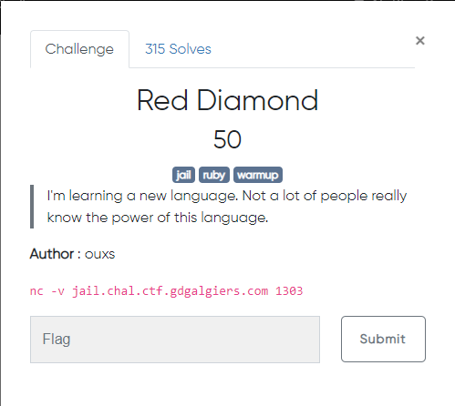
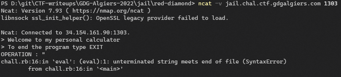
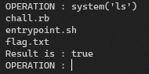

## Preview:

c
## Walkthrough
Connecting to the server:
> nc -v jail.chal.ctf.gdgalgiers.com 1303

if we pass `"` as a input it response with a error, and we see that it handled with the eval function:

> The Eval function evaluates the string expression and returns its value. For example, Eval("1 + 1") returns 2. If you pass to the Eval function a string that contains the name of a function, the Eval function returns the return value of the function.

So if i try to pass the system function with a system commmand it might work fine.

We can cat the flag by replacing `ls` with `cat flag.txt` again.  