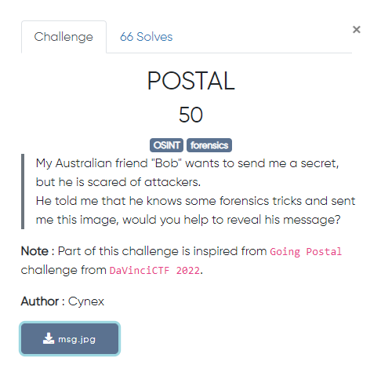
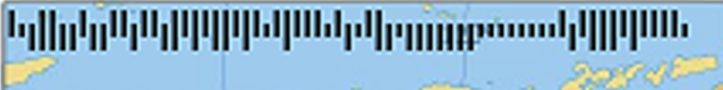
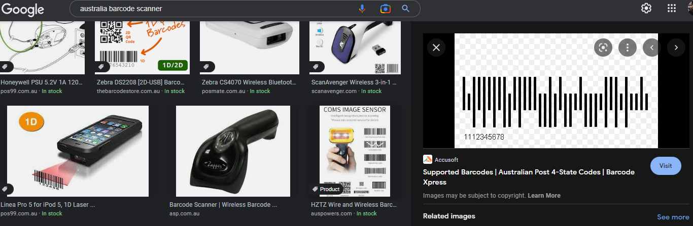
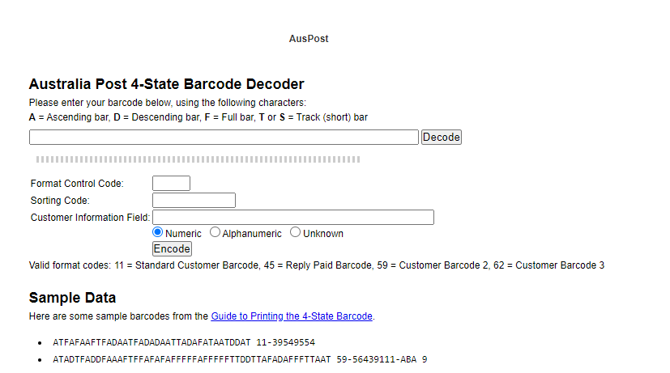
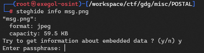

## Preview




By opening the image we'll see australia map 


We notice a barcodes in the upper left part of the image




If we do some google search "australia barcode scanner"
trying to get some similar images. And I get the following:


It seems to be a 4 state codes barcode, I'll research again for a decoder/scanner "australia post 4-state barcode decoder"


We'll end up with this decoder [here](http://bobcodes.weebly.com/auspost.html) 


> A = Ascending bar, D = Descending bar, F = Full bar, T or S = Track (short) bar

After a awful time trying to match those characters we have this:


So we got some information they might be helpful

If we use [steghide](https://steghide.sourceforge.net/) steganography tool to check if there's some data hidden inside our image 


So yes, it revealed that there's some embedded data and It asking for a passphrase 

If we use the Customer Information value from the informations we got after decoding the image barcode. `K4N64r00zz` We will be able to extract a zip file
```bash
┌──(root㉿exegol-osint)-[/workspace/ctf/gdg/misc/POSTAL]
└─# steghide extract -sf msg.png
Enter passphrase:
wrote extracted data to "Treasure.zip".

┌──(root㉿exegol-osint)-[/workspace/ctf/gdg/misc/POSTAL]
└─# ls
msg.png  Treasure.zip
```

the zip file encrypted also, I'll use john for cracking it after getting it hash.

```bash
┌──(root㉿exegol-osint)-[/workspace/ctf/gdg/misc/POSTAL]
└─# zip2john Treasure.zip > hash

┌──(root㉿exegol-osint)-[/workspace/ctf/gdg/misc/POSTAL]
└─# ls
hash  msg.png  Treasure.zip
```
cracking it 
```bash
┌──(root㉿exegol-osint)-[/workspace/ctf/gdg/misc/POSTAL]
└─# john --wordlist='/usr/share/wordlists/rockyou.txt' hash 
Using default input encoding: UTF-8
Loaded 2 password hashes with 2 different salts (ZIP, WinZip [PBKDF2-SHA1 256/256 AVX2 8x])
Loaded hashes with cost 1 (HMAC size) varying from 86 to 121
Will run 2 OpenMP threads
Press 'q' or Ctrl-C to abort, almost any other key for status
baltimore        (Treasure.zip/findme)     
baltimore        (Treasure.zip/flag.txt.gpg)     
2g 0:00:00:01 DONE (2022-10-12 7:27) 1.104g/s 5216p/s 13577c/s 11979C/s total90..hawkeye
Use the "--show" option to display all of the cracked passwords reliably
```

With password `baltimore` we can open the zip file now!

```bash

┌──(root㉿exegol-osint)-[/workspace/ctf/gdg/misc/POSTAL]
└─# 7z x Treasure.zip

7-Zip [64] 16.02 : Copyright (c) 1999-2016 Igor Pavlov : 2016-05-21
p7zip Version 16.02 (locale=en_US.UTF-8,Utf16=on,HugeFiles=on,64 bits,4 CPUs AMD Ryzen 5 3400G with Radeon Vega Graphics     (810F81),ASM,AES-NI)

Scanning the drive for archives:
1 file, 677 bytes (1 KiB)

Extracting archive: Treasure.zip
--
Path = Treasure.zip
Type = zip
Physical Size = 677


Enter password (will not be echoed):
Everything is Ok

Files: 2
Size:       218
Compressed: 677
```

If we cat the `findme` file we'll get:

```
┌──(root㉿exegol-osint)-[/workspace/ctf/gdg/misc/POSTAL]
└─# cat findme
nice you are close
do you know gpg....?
I think you have the password just get back to your notes :)
```
> GPG is a popular Linux encrypting tool. Find out how to use its power to keep private files private. Posted: June 15, 2021 | 2 min read | by Ken Hess (Alumni, Red Hat) Image by Pete Linforth from Pixabay. The GNU Privacy Guard (GPG or gpg) tool is a native/baseos security tool for encrypting files

if we use it on the flag.txt.gpg. 

```bash
                         lqqqqqqqqqqqqqqqqqqqqqqqqqqqqqqqqqqqqqqqqqqqqqqqqqqqqqqk
                         x Please enter the passphrase for decryption.          x
                         x                                                      x
                         x Passphrase: ________________________________________ x
                         x                                                      x
                         x       <OK>                              <Cancel>     x
                         mqqqqqqqqqqqqqqqqqqqqqqqqqqqqqqqqqqqqqqqqqqqqqqqqqqqqqqj
```


And if we pass the sorting Code from the decoded barcode again we'll get the flag file decrypted fine

```bash
┌──(root㉿exegol-osint)-[/workspace/ctf/gdg/misc/POSTAL]
└─# gpg flag.txt.gpg
gpg: WARNING: no command supplied.  Trying to guess what you mean ...
gpg: AES256.CFB encrypted data
gpg: encrypted with 1 passphrase

┌──(root㉿exegol-osint)-[/workspace/ct*f/gdg/misc/POSTAL]
└─# ls
findme  flag.txt  flag.txt.gpg  hash  msg.png  Treasure.zip
```
yep, we got the flag!