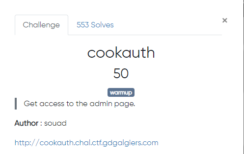
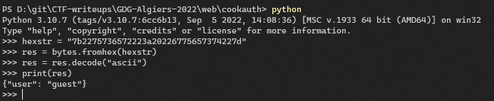
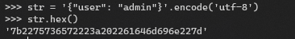

## Preview

## Walkthrough

After visiting the webpage, if we check the cookies given `_info_user` is looking like holding a hexdecimal value

 

Trying to decode it to a ascii:

Changing `guest` to `admin` then encode it the hex again

visiting the admin page with it, and it is valid! 