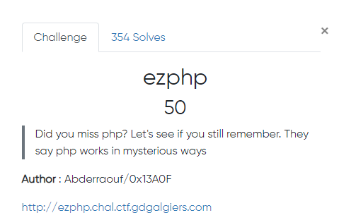

## Preview




If we visit the webapge, we'll get the a php source code:

```php
<?php
session_start();
include "flag.php";

if (!isset($_GET["login"]) || !isset($_GET["pass"]))
    die(show_source(__FILE__));

if ($_SESSION["admin"] == 1)
        echo $FLAG;

$login = $_GET["login"];
$password = $_GET["pass"];
$_SESSION["admin"] = 1;
if ($login !== "admin" && md5($password) !== "117080b3bcbd07588b4df032280f46a5")
{
    echo "Wrong password\n";
    $_SESSION["admin"] = 0;
}

?>
```

Well, the trick is with the if condition especially the `&&` operator 

> `&&` is used to perform `AND` operation means if anyone of the expression/condition evaluates to false whole thing is false.
so if any one of the condition becomes false it won't even continue further to check 


> `||` is used to perform `OR` operation if anyone of the expression/condition evaluates to true whole thing becomes true.
so it continues till the end to check atleast one condition to become true.

So it's clear enough. For example passing url parameters as the following response with the flag:

/?login=admin&pass=
